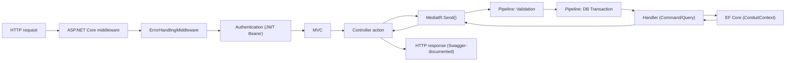
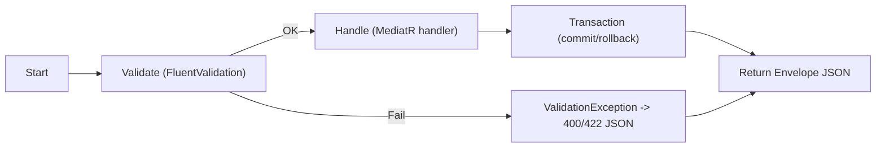

# ASP.NET Core RealWorld Example App – Developer Guide and API Reference

## 1) Project Overview

This repository implements the RealWorld API specification using ASP.NET Core, showcasing a clean, feature‑oriented Web API architecture with CQRS and MediatR. It demonstrates CRUD for articles and comments, profile management, tag listing, following/unfollowing, favoriting, authentication with JWT, validation via FluentValidation, persistence with EF Core, logging using Serilog, and API documentation via Swagger.

The codebase favors vertical slices (feature folders) and thin controllers. Each HTTP request is modeled as a Command or Query handled by MediatR. Cross‑cutting concerns—validation, transactions, error handling, logging—are centralized using middleware and pipeline behaviors.

Key technologies: ASP.NET Core 8, MediatR, FluentValidation, AutoMapper, EF Core (SQLite by default), Serilog, Swashbuckle (Swagger), and JWT Bearer authentication.

## 2) Directory and Module Summary

- src/Conduit
  - Program.cs: Application bootstrap; DI, MVC, Swagger, CORS, Authentication, middleware, DbContext configuration, and database EnsureCreated.
  - ServicesExtensions.cs: DI extension methods
    - AddConduit(): Registers MediatR, pipeline behaviors, validators, AutoMapper, and application services.
    - AddJwt(): Configures JWT Bearer authentication and token validation.
    - AddSerilogLogging(): Configures Serilog console logging.
  - Domain/: Entity classes (Article, Comment, Person, Tag, ArticleTag, ArticleFavorite, FollowedPeople).
  - Infrastructure/:
    - ConduitContext.cs: EF Core DbContext, model configuration, and transaction helpers.
    - Errors/: RestException, ErrorHandlingMiddleware, error constants.
    - Security/: JwtIssuerOptions, JwtTokenGenerator, IPasswordHasher, PasswordHasher.
    - ICurrentUserAccessor, CurrentUserAccessor: Current user information from HttpContext.
    - ValidationPipelineBehavior, DBContextTransactionPipelineBehavior: MediatR pipeline behaviors.
    - ValidatorActionFilter: JSON 422 result for invalid model state.
    - GroupByApiRootConvention: Groups Swagger endpoints by route root.
  - Features/: Vertical slices per feature area
    - Users/: Registration, login, edit, details; UsersController (POST /users, POST /users/login), UserController (GET/PUT /user).
    - Articles/: List, details, create, edit, delete; ArticlesController.
    - Comments/: List, create, delete; CommentsController.
    - Favorites/: Add/delete favorite; FavoritesController.
    - Followers/: Follow/unfollow; FollowersController.
    - Profiles/: Read profile; ProfilesController.
    - Tags/: List tags; TagsController.
- tests/Conduit.IntegrationTests: Integration tests with EF InMemory and a test fixture (SliceFixture), demonstrating usage patterns and core flows.
- Dockerfile, docker-compose.yml, Makefile: Containerized build/run (exposes port 8080).
- Directory.Packages.props: Central package version management.

## 3) Class Documentation

### 3.1 Domain Model

- Article
  - Purpose: Blog post content with author, comments, tags, and favorite metadata for API responses.
  - Role: Aggregate root for article content.
  - Important properties:
    - ArticleId (int, [JsonIgnore]): internal key
    - Slug (string): URL slug
    - Title, Description, Body (string)
    - Author (Person)
    - Comments (List<Comment>)
    - Favorited (bool, computed): true if any favorites exist
    - FavoritesCount (int, computed)
    - TagList (List<string>, computed from ArticleTags)
    - ArticleTags (List<ArticleTag>, [JsonIgnore])
    - ArticleFavorites (List<ArticleFavorite>, [JsonIgnore])
    - CreatedAt (DateTime), UpdatedAt (DateTime)

- Comment
  - Purpose: User comment on an article.
  - Properties: CommentId (serialized as "id"), Body, Author (Person), Article (ignored), CreatedAt, UpdatedAt.

- Person
  - Purpose: User account and profile data.
  - Properties: PersonId ([JsonIgnore]), Username, Email, Bio, Image, Hash ([JsonIgnore]), Salt ([JsonIgnore]); relations: ArticleFavorites, Following, Followers (all [JsonIgnore]).

- Tag
  - Purpose: Tag entity identified by TagId.
  - Properties: TagId (string), ArticleTags.

- ArticleTag
  - Purpose: Join entity between Article and Tag.
  - Properties: ArticleId, TagId; navigation: Article, Tag.

- ArticleFavorite
  - Purpose: Join entity between Person and favorited Article.
  - Properties: ArticleId, PersonId; navigation: Article, Person.

- FollowedPeople
  - Purpose: Join entity for follow relationships between people.
  - Properties: ObserverId, TargetId; navigation: Observer, Target.

### 3.2 Infrastructure

- ConduitContext : DbContext
  - Purpose: EF Core context for all domain entities and transaction helper methods.
  - Role: Persistence configuration and transaction boundaries for pipeline behavior.
  - Important members:
    - DbSets: Articles, Comments, Persons, Tags, ArticleTags, ArticleFavorites, FollowedPeople
    - OnModelCreating: configures composite keys and relationships; restricts delete behavior for FollowedPeople on SQL Server
    - BeginTransaction(), CommitTransaction(), RollbackTransaction()

- ErrorHandlingMiddleware
  - Purpose: Central exception handling and JSON error responses.
  - Role: Converts RestException into expected API error payload; logs unhandled exceptions; returns 500 for unknown errors.

- RestException : Exception
  - Purpose: Domain-specific HTTP exception with status code and error object.
  - Properties: Code (HttpStatusCode), Errors (object?)

- Constants
  - Purpose: Common error keys ("not found", "in use", "InternalServerError").

- ICurrentUserAccessor / CurrentUserAccessor
  - Purpose: Abstraction and implementation for retrieving the current username from HttpContext claims.

- ValidationPipelineBehavior<TRequest,TResponse>
  - Purpose: Validates incoming MediatR requests using FluentValidation; throws ValidationException on failures.

- DBContextTransactionPipelineBehavior<TRequest,TResponse>
  - Purpose: Wraps request handling in a database transaction (skips for InMemory provider).

- ValidatorActionFilter
  - Purpose: Returns 422 JSON error when model state is invalid (MVC layer).

- GroupByApiRootConvention
  - Purpose: Sets Swagger group name to the route root (e.g., "articles", "tags").

### 3.3 Security

- JwtIssuerOptions
  - Purpose: JWT token issuance configuration (issuer, audience, validity, signing credentials).
  - Notable: Schemes = "Bearer"; default ValidFor = 5 minutes.

- IJwtTokenGenerator / JwtTokenGenerator
  - Purpose: Abstraction and implementation to create JWTs; includes standard claims (sub, jti, iat).

- IPasswordHasher / PasswordHasher
  - Purpose: Hash passwords using HMACSHA512 with a salt.

### 3.4 Application Bootstrap

- ServicesExtensions
  - AddConduit(): Registers MediatR, validators, AutoMapper, security services, IHttpContextAccessor.
  - AddJwt(): Configures JWT Bearer authentication; accepts both "Bearer <token>" (default) and "Token <token>" header formats.
  - AddSerilogLogging(): Console logging sink and minimum log level configuration.

- Program
  - Purpose: App startup configuration.
  - Role: Registers DbContext (SQLite by default), Swagger, CORS, middleware, MVC; EnsureCreated at startup.

### 3.5 Feature Slices

Each feature folder encapsulates:
- Transport layer: Controller (routes)
- Request/Response models: Envelopes and records
- Validation: FluentValidation validators
- Handler: MediatR IRequestHandler implementation

Key public types (by folder):

- Features/Users
  - UsersController (POST /users, POST /users/login)
  - UserController (GET /user, PUT /user) [Authorize]
  - Create, Login, Details, Edit classes (with nested records: Command/Query, Validator, Handler)
  - MappingProfile, User (DTO), UserEnvelope

- Features/Articles
  - ArticlesController (GET list, GET feed, GET by slug, POST, PUT, DELETE)
  - Create, Edit, Delete, List, Details classes (with nested types)
  - ArticleEnvelope, ArticlesEnvelope, ArticleExtensions

- Features/Comments
  - CommentsController (POST, GET, DELETE under /articles/{slug})
  - Create, List, Delete classes; CommentEnvelope, CommentsEnvelope

- Features/Tags
  - TagsController (GET /tags), List class, TagsEnvelope

- Features/Favorites
  - FavoritesController (POST/DELETE /articles/{slug}/favorite), Add, Delete classes

- Features/Followers
  - FollowersController (POST/DELETE /profiles/{username}/follow), Add, Delete classes

- Features/Profiles
  - ProfilesController (GET /profiles/{username})
  - Details (Query), ProfileReader (IProfileReader), Profile (DTO), ProfileEnvelope

## 4) Method Documentation (Significant Methods)

### 4.1 Bootstrap and Configuration

- ServicesExtensions.AddConduit(IServiceCollection services)
  - Purpose: Register core services, MediatR, pipeline behaviors, validators, AutoMapper, and application services.
  - Parameters: services (IServiceCollection) – DI container.
  - Returns: void
  - Side effects: Registers IPipelineBehavior<,>, IPasswordHasher, IJwtTokenGenerator, ICurrentUserAccessor, IProfileReader.
  - Exceptions: None.

- ServicesExtensions.AddJwt(IServiceCollection services)
  - Purpose: Configure JWT Bearer authentication and token validation parameters; support "Token <jwt>" headers.
  - Parameters: services (IServiceCollection).
  - Returns: void
  - Side effects: Adds authentication schemes; configures JwtBearerEvents to parse "Token " header value.
  - Exceptions: None.

- ServicesExtensions.AddSerilogLogging(ILoggerFactory loggerFactory)
  - Purpose: Configure Serilog with console sink.
  - Parameters: loggerFactory (ILoggerFactory).
  - Returns: void
  - Side effects: Sets Log.Logger singleton; writes to console.

- Program (top-level)
  - Purpose: Build and run host, register middlewares, MVC, Swagger, DbContext.
  - Notable configuration:
    - DbContext: SQLite by default ("Filename=realworld.db"); optional SQL Server path if code is updated to set databaseProvider = "sqlserver".
    - Middleware: ErrorHandlingMiddleware; CORS (AllowAnyOrigin/Header/Method).
    - Swagger: /swagger/v1/swagger.json, UI at /swagger.
    - EnsureCreated: Ensures database exists on startup.

### 4.2 Infrastructure

- ConduitContext.OnModelCreating(ModelBuilder)
  - Purpose: Configure join entities and relationships; define composite keys; restrict cascades for FollowedPeople.
  - Returns: void

- ConduitContext.BeginTransaction()
  - Purpose: Begin a transaction (skips for EF InMemory provider).
  - Returns: void
  - Side effects: Creates IDbContextTransaction with IsolationLevel.ReadCommitted.

- ConduitContext.CommitTransaction()
  - Purpose: Commit transaction if present.
  - Returns: void
  - Exceptions: Re-throws after RollbackTransaction() on commit failures.

- ConduitContext.RollbackTransaction()
  - Purpose: Rollback if a transaction is present.

- ErrorHandlingMiddleware.Invoke(HttpContext)
  - Purpose: Wrap request processing to capture exceptions and write JSON responses.
  - Returns: Task
  - Exceptions handled:
    - RestException => returns status code and { errors = ... } payload
    - Any other => 500 with { errors = "InternalServerError" }

- ValidationPipelineBehavior<TRequest,TResponse>.Handle(...)
  - Purpose: Validate request using all IValidator<TRequest>; throw on validation failures.
  - Returns: TResponse
  - Exceptions: FluentValidation.ValidationException

- DBContextTransactionPipelineBehavior<TRequest,TResponse>.Handle(...)
  - Purpose: Wrap request handler in DB transaction; begin/commit/rollback.
  - Returns: TResponse

- GroupByApiRootConvention.Apply(ControllerModel)
  - Purpose: Set ApiExplorer.GroupName to first path segment based on [Route] template.

- ValidatorActionFilter.OnActionExecuting(...)
  - Purpose: If ModelState invalid, return 422 with { errors: { field: [messages] } }.

- CurrentUserAccessor.GetCurrentUsername()
  - Purpose: Read ClaimTypes.NameIdentifier from HttpContext.User.
  - Returns: string? username

- JwtTokenGenerator.CreateToken(string username)
  - Purpose: Create a JWT with "sub", "jti", and "iat" claims; signs using provided credentials.
  - Returns: string (JWT)

- PasswordHasher.Hash(string password, byte[] salt)
  - Purpose: Compute HMACSHA512 hash for a password with salt.
  - Returns: Task<byte[]>

### 4.3 Feature Handlers (selected)

- Users.Create.Handler.Handle(Command, CancellationToken) => UserEnvelope
  - Purpose: Register a new user, hash password, persist, and issue JWT.
  - Validations: Username, Email, Password must not be null/empty; uniqueness on username and email.
  - Exceptions: RestException BadRequest with Username/Email "in use".

- Users.Login.Handler.Handle(Command, CancellationToken) => UserEnvelope
  - Purpose: Validate email/password, return user with token.
  - Exceptions: RestException Unauthorized on invalid credentials.

- Users.Details.QueryHandler.Handle(Query, CancellationToken) => UserEnvelope
  - Purpose: Return user by username with a fresh token.
  - Exceptions: RestException NotFound.

- Users.Edit.Handler.Handle(Command, CancellationToken) => UserEnvelope
  - Purpose: Update current authenticated user's profile; re-hash password if provided.
  - Exceptions: RestException NotFound for missing current user.

- Articles.Create.Handler.Handle(Command, CancellationToken) => ArticleEnvelope
  - Purpose: Create article for current user; ensure tags exist; set slug; persist.
  - Validations: Title, Description, Body required.
  - Side effects: Creates/attaches tags and article-tag relationships.

- Articles.Edit.Handler.Handle(Command, CancellationToken) => ArticleEnvelope
  - Purpose: Update article fields and synchronize article tags (add/remove).
  - Exceptions: RestException NotFound if article missing.

- Articles.Delete.QueryHandler.Handle(Command, CancellationToken) => Unit
  - Purpose: Delete article by slug.
  - Exceptions: RestException NotFound.

- Articles.List.QueryHandler.Handle(Query, CancellationToken) => ArticlesEnvelope
  - Purpose: Filtered listing by tag, author, favorited; "feed" returns followed users' articles when authenticated.

- Comments.Create.Handler.Handle(Command, CancellationToken) => CommentEnvelope
  - Purpose: Add a comment to an article by current user.
  - Exceptions: RestException NotFound for article.

- Comments.List.QueryHandler.Handle(Query, CancellationToken) => CommentsEnvelope
  - Purpose: Return article comments (with author).

- Comments.Delete.QueryHandler.Handle(Command, CancellationToken) => Unit
  - Purpose: Delete comment under article.
  - Exceptions: RestException NotFound (article or comment).

- Favorites.Add.QueryHandler.Handle(Command, CancellationToken) / Favorites.Delete.QueryHandler.Handle(...) => ArticleEnvelope
  - Purpose: Add/remove favorite relation for current user.
  - Exceptions: RestException NotFound (article or user).

- Followers.Add.QueryHandler.Handle(Command, CancellationToken) / Followers.Delete.QueryHandler.Handle(...) => ProfileEnvelope
  - Purpose: Follow/unfollow target user; return updated profile with following flag.
  - Exceptions: RestException NotFound (target/observer).

- Profiles.ProfileReader.ReadProfile(username, cancellationToken) => ProfileEnvelope
  - Purpose: Read a profile and compute following flag relative to current user (if authenticated).
  - Exceptions: RestException NotFound (user or current user when needed).

## 5) API Endpoint Documentation

Base URL
- Local (dotnet run): http://localhost:5000 (Swagger at /swagger)
- Docker (compose): http://localhost:8080 (Swagger at /swagger)

Authentication
- Scheme: JWT Bearer (Authorization header)
- Accepted header formats: "Bearer <token>" and "Token <token>"

### 5.1 Users

- POST /users
  - Description: Register new user.
  - Body (JSON):
    ```json
    {
      "user": { "username": "jake", "email": "jake@example.com", "password": "secret" }
    }
    ```
  - Response 200 (application/json):
    ```json
    {
      "user": {
        "username": "jake",
        "email": "jake@example.com",
        "bio": null,
        "image": null,
        "token": "<jwt>"
      }
    }
    ```
  - Errors: 400 with { "errors": { "Username": "in use" } } or { "errors": { "Email": "in use" } }

- POST /users/login
  - Description: Authenticate and receive JWT.
  - Body:
    ```json
    {
      "user": { "email": "jake@example.com", "password": "secret" }
    }
    ```
  - Response 200: Same envelope as registration with a fresh token.
  - Errors: 401 { "errors": { "Error": "Invalid email / password." } }

- GET /user (auth required)
  - Description: Get current authenticated user details with a fresh JWT.
  - Response 200:
    ```json
    {
      "user": {
        "username": "jake",
        "email": "jake@example.com",
        "bio": "about me",
        "image": null,
        "token": "<jwt>"
      }
    }
    ```

- PUT /user (auth required)
  - Description: Update current user (any subset of fields).
  - Body:
    ```json
    {
      "user": {
        "username": "newname",
        "email": "new@example.com",
        "password": "newpass",
        "bio": "updated bio",
        "image": "https://example.com/me.png"
      }
    }
    ```
  - Response 200: Updated user envelope.

### 5.2 Profiles and Follows

- GET /profiles/{username}
  - Description: Get public profile; if authenticated, "following" reflects current user's follow state.
  - Response:
    ```json
    {
      "profile": {
        "username": "jane",
        "bio": "hi",
        "image": null,
        "following": true
      }
    }
    ```

- POST /profiles/{username}/follow (auth required)
  - Description: Follow a user.
  - Response: Profile envelope with following=true.

- DELETE /profiles/{username}/follow (auth required)
  - Description: Unfollow a user.
  - Response: Profile envelope with following=false.

### 5.3 Articles

- GET /articles
  - Description: List articles with filters.
  - Query params:
    - tag: string
    - author: string (username)
    - favorited: string (username)
    - limit: int (default 20)
    - offset: int (default 0)
  - Response:
    ```json
    {
      "articles": [
        {
          "slug": "hello-world",
          "title": "Hello World",
          "description": "Intro",
          "body": "Markdown or text",
          "author": { "username": "jake", "email": "jake@example.com", "bio": null, "image": null },
          "comments": [],
          "favorited": false,
          "favoritesCount": 0,
          "tagList": ["intro","welcome"],
          "createdAt": "2024-01-01T00:00:00Z",
          "updatedAt": "2024-01-01T00:00:00Z"
        }
      ],
      "articlesCount": 1
    }
    ```

- GET /articles/feed
  - Description: If authenticated, returns feed from followed users; otherwise behaves like general list.

- GET /articles/{slug}
  - Description: Get single article by slug.
  - Response: `{ "article": { ...article fields... } }`

- POST /articles (auth required)
  - Description: Create an article.
  - Body:
    ```json
    {
      "article": {
        "title": "My Article",
        "description": "What it's about",
        "body": "The content",
        "tagList": ["csharp", "aspnetcore"]
      }
    }
    ```
  - Response: Article envelope with created article including computed slug.

- PUT /articles/{slug} (auth required)
  - Description: Update fields and tag list. Recomputes slug from (possibly) updated title.
  - Body:
    ```json
    {
      "article": {
        "title": "Updated",
        "description": "Updated",
        "body": "Updated",
        "tagList": ["aspnetcore","webapi"]
      }
    }
    ```

- DELETE /articles/{slug} (auth required)
  - Description: Delete the article.

### 5.4 Comments

- GET /articles/{slug}/comments
  - Description: List comments for an article.
  - Response:
    ```json
    {
      "comments": [
        {
          "id": 1,
          "body": "Nice post!",
          "author": { "username": "jake", "email": "jake@example.com", "bio": null, "image": null },
          "createdAt": "2024-01-01T00:00:00Z",
          "updatedAt": "2024-01-01T00:00:00Z"
        }
      ]
    }
    ```

- POST /articles/{slug}/comments (auth required)
  - Description: Create a comment.
  - Body:
    ```json
    { "comment": { "body": "Great article!" } }
    ```
  - Response: `{ "comment": { ...comment fields... } }`

- DELETE /articles/{slug}/comments/{id} (auth required)
  - Description: Delete a comment by its id under the specified article.

### 5.5 Favorites

- POST /articles/{slug}/favorite (auth required)
  - Description: Favorite an article; response is the updated article envelope.

- DELETE /articles/{slug}/favorite (auth required)
  - Description: Unfavorite an article; response is the updated article envelope.

### 5.6 Tags

- GET /tags
  - Description: List all tags.
  - Response: `{ "tags": ["csharp","aspnetcore"] }`

## 6) Architectural Concepts & Patterns

- Vertical slices / feature folders
  - Each feature (Users, Articles, etc.) encapsulates transport (Controller), validation, request/response models, and handler logic in a single folder to minimize coupling and increase cohesion.

- CQRS with MediatR
  - Commands and Queries represented as records (e.g., Create.Command, Details.Query), processed by IRequestHandler implementations.
  - Thin controllers delegate to mediator: Controller action => mediator.Send(request).

- Pipeline behaviors
  - ValidationPipelineBehavior: Validates every request via FluentValidation before handler execution.
  - DBContextTransactionPipelineBehavior: Wraps request handling in a transaction (skips InMemory).

- AutoMapper
  - Profile mappings for Users and Profiles convert domain entities to API DTOs (e.g., Person -> User, Person -> Profile).

- FluentValidation
  - Validators live close to their commands/queries (e.g., Create.CommandValidator); validation failures raise ValidationException handled by middleware.

- EF Core
  - ConduitContext configures relations for join entities; On startup Program ensures DB exists (EnsureCreated); queries use AsNoTracking for read endpoints; projection and includes encapsulated in ArticleExtensions.GetAllData().

- Serilog
  - Console sink with verbose level for local development; logger wired via ILoggerFactory extension.

- Swagger (Swashbuckle)
  - Security definition "Bearer"; Swagger UI at /swagger; controllers grouped by route root via GroupByApiRootConvention.

- JWT Authentication
  - JwtBearer authentication configured with symmetric signing key and validation parameters; OnMessageReceived supports token header prefix "Token " in addition to standard "Bearer ".

Mermaid request pipeline overview:


## 7) Dependencies

From Directory.Packages.props (central versions):
- AutoMapper: object mapping between domain and DTOs.
- MediatR: in-process mediator for CQRS patterns.
- FluentValidation and FluentValidation.DependencyInjectionExtensions: request model validation.
- Microsoft.AspNetCore.Authentication.JwtBearer: JWT auth.
- EF Core (InMemory, Sqlite, SqlServer): persistence providers.
- Serilog, Serilog.Extensions.Logging, Serilog.Sinks.Console: structured logging.
- Swashbuckle.AspNetCore: Swagger/OpenAPI generation and UI.
- Test libs: Microsoft.NET.Test.Sdk, xunit, xunit.runner.visualstudio.
- Build tooling (repository root scripts): Bullseye, SimpleExec.

## 8) Build & Run Instructions

Prerequisites:
- .NET 8 SDK

Local run (SQLite by default):
- Restore/build/run
  - dotnet restore
  - dotnet build
  - dotnet run --project src/Conduit/Conduit.csproj
- Swagger UI: http://localhost:5000/swagger
- Database:
  - Provider: SQLite
  - Connection: Filename=realworld.db (created in working directory)
  - Database is created automatically on startup (EnsureCreated). Migrations are not required for default setup.

Docker:
- Build: make build (runs docker compose build)
- Run: make run (exposes 8080)
- Swagger UI: http://localhost:8080/swagger

SQL Server (optional):
- Program.cs currently defaults to SQLite and does not read env vars at runtime. To use SQL Server:
  - Update Program.cs to set
    - databaseProvider = "sqlserver"
    - connectionString = "<your-connection-string>"
  - Note: Comment indicates SQL Server path works in Windows container contexts.

Run tests:
- dotnet test tests/Conduit.IntegrationTests/Conduit.IntegrationTests.csproj

Authorizing in Swagger:
- Click "Authorize" and paste: Bearer <jwt>
- Alternatively, this API also accepts header format: Token <jwt>

## 9) Core Flows (annotated C# snippets)

### 9.1 User Registration

```csharp
// Request model envelope
public record Command(UserData User) : IRequest<UserEnvelope>;
public record UserData(string? Username, string? Email, string? Password);

// Validator
RuleFor(x => x.User.Username).NotNull().NotEmpty();
RuleFor(x => x.User.Email).NotNull().NotEmpty();
RuleFor(x => x.User.Password).NotNull().NotEmpty();

// Handler (simplified)
public async Task<UserEnvelope> Handle(Command msg, CancellationToken ct)
{
    // Uniqueness checks
    if (await context.Persons.AnyAsync(x => x.Username == msg.User.Username, ct))
        throw new RestException(HttpStatusCode.BadRequest, new { Username = Constants.IN_USE });

    if (await context.Persons.AnyAsync(x => x.Email == msg.User.Email, ct))
        throw new RestException(HttpStatusCode.BadRequest, new { Email = Constants.IN_USE });

    // Hash password
    var salt = Guid.NewGuid().ToByteArray();
    var person = new Person
    {
        Username = msg.User.Username,
        Email = msg.User.Email,
        Hash = await passwordHasher.Hash(msg.User.Password!, salt),
        Salt = salt
    };

    await context.Persons.AddAsync(person, ct);
    await context.SaveChangesAsync(ct);

    // Map + issue token
    var user = mapper.Map<Person, User>(person);
    user.Token = jwt.CreateToken(person.Username!);

    return new UserEnvelope(user);
}
```

Example HTTP:
```bash
curl -X POST http://localhost:5000/users \
  -H "Content-Type: application/json" \
  -d '{"user":{"username":"jake","email":"jake@example.com","password":"secret"}}'
```

### 9.2 Authentication and JWT issuance

```csharp
// Login handler (simplified)
var person = await context.Persons.SingleOrDefaultAsync(x => x.Email == msg.User.Email, ct);
if (person == null) throw new RestException(HttpStatusCode.Unauthorized, new { Error = "Invalid email / password." });

var ok = person.Hash.SequenceEqual(await passwordHasher.Hash(msg.User.Password!, person.Salt));
if (!ok) throw new RestException(HttpStatusCode.Unauthorized, new { Error = "Invalid email / password." });

var user = mapper.Map<Person, User>(person);
user.Token = jwt.CreateToken(person.Username!); // standard "sub" claim
return new UserEnvelope(user);
```

Attach token to requests:
- Authorization: Bearer <jwt> (or Token <jwt>)

### 9.3 Article Creation

```csharp
// Request model
public class ArticleData { public string? Title; public string? Description; public string? Body; public string[]? TagList; }
public record Command(ArticleData Article) : IRequest<ArticleEnvelope>;

// Validator
RuleFor(x => x.Article.Title).NotNull().NotEmpty();
RuleFor(x => x.Article.Description).NotNull().NotEmpty();
RuleFor(x => x.Article.Body).NotNull().NotEmpty();

// Handler (simplified)
var author = await context.Persons.FirstAsync(x => x.Username == currentUser.GetCurrentUsername(), ct);

// Ensure tag entities exist (create if missing)
var tags = new List<Tag>();
foreach (var tag in (msg.Article.TagList ?? Enumerable.Empty<string>()))
{
    var t = await context.Tags.FindAsync(tag);
    if (t == null) { t = new Tag { TagId = tag }; await context.Tags.AddAsync(t, ct); await context.SaveChangesAsync(ct); }
    tags.Add(t);
}

// Create article + relations
var article = new Article
{
    Author = author,
    Body = msg.Article.Body,
    CreatedAt = DateTime.UtcNow,
    UpdatedAt = DateTime.UtcNow,
    Description = msg.Article.Description,
    Title = msg.Article.Title,
    Slug = msg.Article.Title.GenerateSlug()
};
await context.Articles.AddAsync(article, ct);
await context.ArticleTags.AddRangeAsync(tags.Select(x => new ArticleTag { Article = article, Tag = x }), ct);
await context.SaveChangesAsync(ct);

return new ArticleEnvelope(article);
```

### 9.4 Commenting on an Article

```csharp
// Request model
public record Model(CommentData Comment);
public record CommentData(string? Body);
public record Command(Model Model, string Slug) : IRequest<CommentEnvelope>;

// Validator
RuleFor(x => x.Model.Comment.Body).NotEmpty();

// Handler (simplified)
var article = await context.Articles.Include(x => x.Comments).FirstOrDefaultAsync(x => x.Slug == msg.Slug, ct)
    ?? throw new RestException(HttpStatusCode.NotFound, new { Article = Constants.NOT_FOUND });

var author = await context.Persons.FirstAsync(x => x.Username == currentUser.GetCurrentUsername(), ct);

var comment = new Comment
{
    Author = author,
    Body = msg.Model.Comment.Body!,
    CreatedAt = DateTime.UtcNow,
    UpdatedAt = DateTime.UtcNow
};

await context.Comments.AddAsync(comment, ct);
article.Comments.Add(comment);
await context.SaveChangesAsync(ct);

return new CommentEnvelope(comment);
```

## 10) Notes & Best Practices

- Thin controllers: All business logic is in MediatR handlers; controllers delegate directly to mediator.
- Validation first: Use FluentValidation validators for commands/queries; invalid data never reaches handlers. MVC-level ValidatorActionFilter also returns 422 for invalid model state.
- Transactions around handlers: The DBContext transaction behavior ensures that each request is atomic (skipped for InMemory provider).
- Error handling: Throw RestException with proper HttpStatusCode for expected errors. ErrorHandlingMiddleware translates it to JSON payloads; logs unknown exceptions and returns 500 with "InternalServerError".
- Mapping: Use AutoMapper profiles for mapping domain entities to DTOs (User, Profile). Domain Article is returned directly for article endpoints; TagList, Favorited, FavoritesCount are computed at runtime.
- Authorization header: Both "Bearer <token>" and "Token <token>" header formats are accepted by the configured JwtBearer handler.
- Tag synchronization in article editing: Edit handler computes additions/removals and updates UpdatedAt only when necessary.
- Query optimization: Use AsNoTracking for read queries and dedicated extension methods (ArticleExtensions.GetAllData) to include related data consistently.
- Testing pattern: Integration tests use SliceFixture with EF InMemory and a scoped service provider; test helpers stub current user (StubCurrentUserAccessor). Consider this pattern for new tests.
- Swagger grouping: Controllers are grouped in Swagger by the first segment of their route (e.g., "articles", "profiles").
- Database initialization: The app calls EnsureCreated on startup; there are no EF migrations by default. If schema changes are needed, either keep EnsureCreated or add EF migrations explicitly.
- SQL Server note: Code path for SQL Server is present but defaults to SQLite; update Program.cs to use SQL Server and provide a proper connection string (works in Windows container scenarios per code comments).
- Security notes: JWT validity is 5 minutes by default (JwtIssuerOptions.ValidFor). Adjust signing key, issuer, audience according to your environment in AddJwt().


