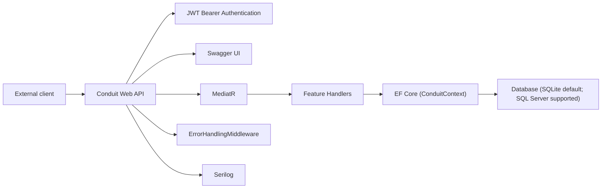
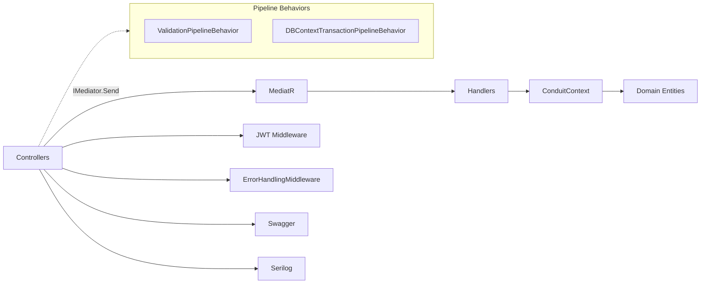
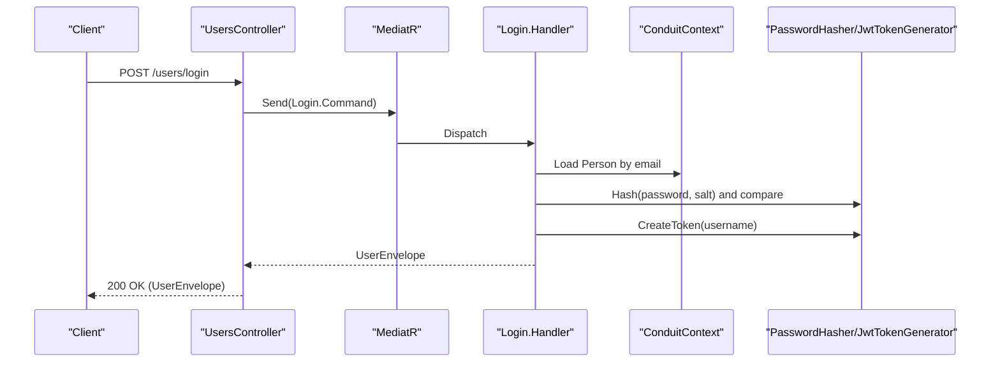
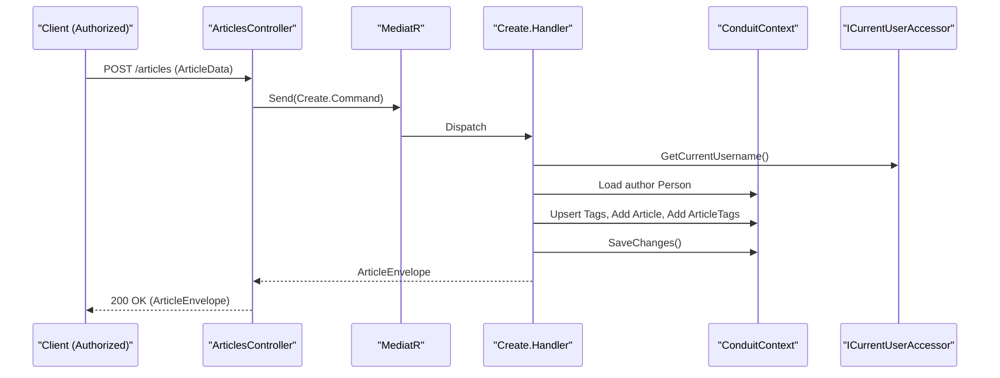
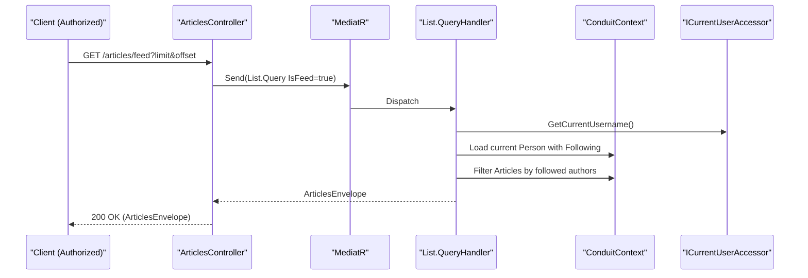
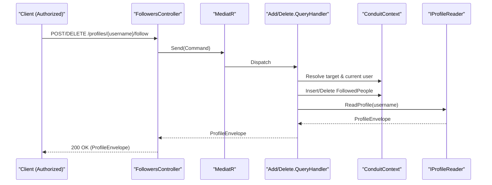
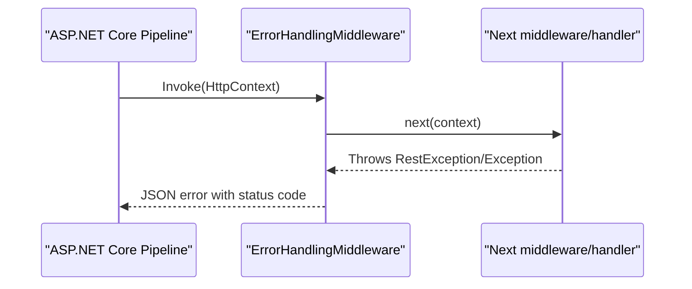
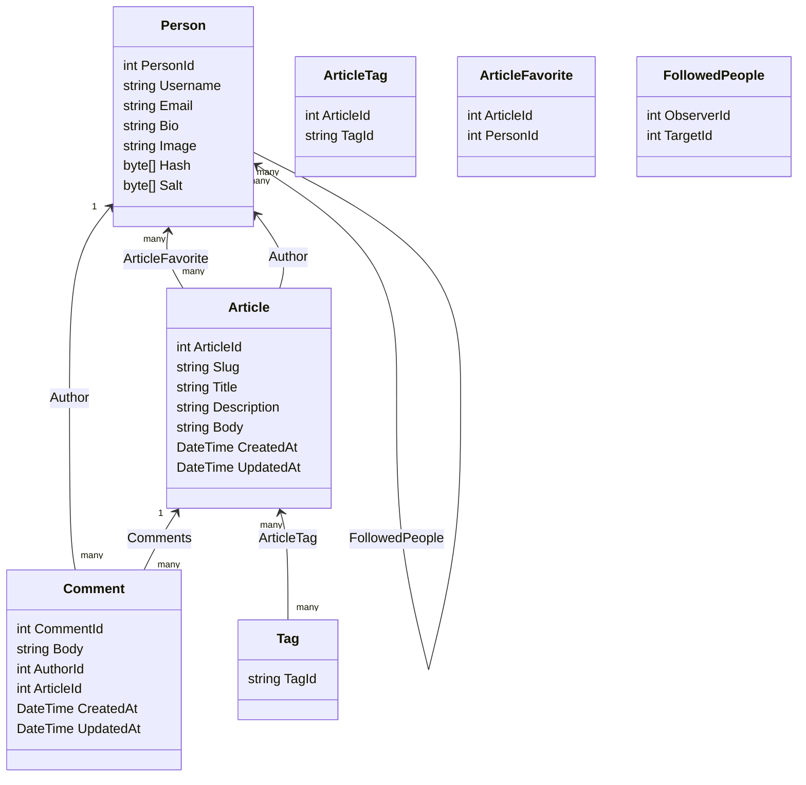
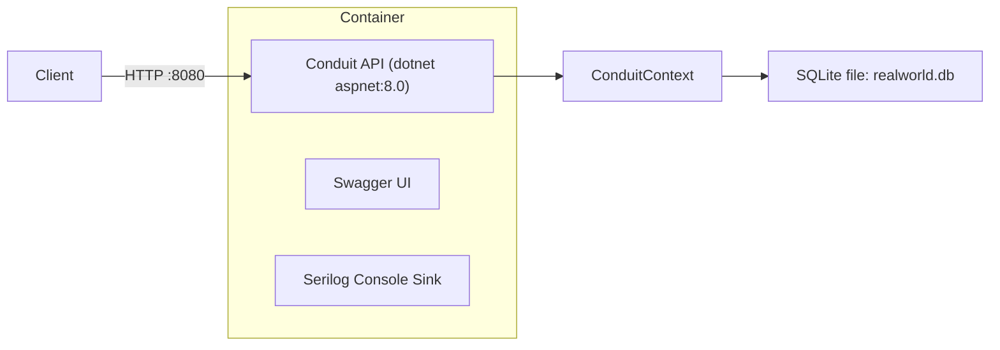
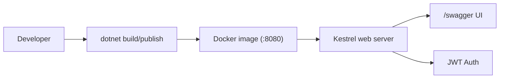

# Conduit ASP.NET Core RealWorld API — Unified Architecture and Code Documentation

## Architecture Overview
This repository implements a RealWorld Conduit backend as an ASP.NET Core 8 Web API. The application is organized by vertical feature slices (Users, Profiles, Followers, Articles, Comments, Favorites, Tags) and uses a CQRS-style approach with MediatR. Controllers are thin and delegate all processing to MediatR handlers. Persistence is via Entity Framework Core with a DbContext named ConduitContext. Security uses JWT Bearer authentication, validation relies on FluentValidation, and the API is documented with Swagger.

The problem domain is a content publishing platform where users can register/login, manage profiles and follow relationships, create and edit articles, tag and favorite articles, and manage comments. The codebase also includes error handling middleware and logging via Serilog.

Assumptions:
- In Docker, the service listens on port 8080 based on the Dockerfile and docker-compose configuration.
- The configuration for JWT (signing key, issuer, audience) is development-oriented as hard-coded in code and would typically be externalized in production.

Completeness notes:
- Program.cs currently uses hard-coded database provider ("sqlite") and connection string ("Filename=realworld.db") and does not consume the environment variables referenced in docker-compose or launchSettings.json.
- The Dockerfile references a build project at build/build.csproj which is not present in this repository snapshot.

## System Context
The system exposes a RESTful HTTP API consumed by external clients (browsers or API clients). It uses:
- ASP.NET Core for hosting, routing (MVC), and middleware.
- MediatR for request/response dispatch and handler execution.
- FluentValidation for validation via a pipeline behavior and an MVC action filter.
- Entity Framework Core as the data access layer.
- AutoMapper for mapping between domain entities and response models.
- JWT Bearer authentication for security with a custom event to accept “Token <jwt>” Authorization headers.
- Serilog for structured logging.
- Swashbuckle for OpenAPI/Swagger generation.

External clients communicate exclusively via HTTP. Authentication is enforced by the JWT middleware as configured in ServicesExtensions.AddJwt.

## High-Level Architecture
The architecture follows a layered, vertically sliced style:

- API Layer: Feature-specific controllers route HTTP requests to MediatR and do minimal processing.
- Application Layer: Feature folders contain request/response types, validators, and handlers implementing the domain behaviors. Pipeline behaviors add validation and database transaction control.
- Infrastructure Layer: EF Core DbContext (ConduitContext), password hashing and token generation, error handling middleware, MVC conventions and filters, and current user access (via IHttpContextAccessor).
- Domain Layer: Entities for Article, Comment, Person, Tag, ArticleTag, ArticleFavorite, and FollowedPeople.

Cross-cutting concerns include:
- Validation: FluentValidation via ValidationPipelineBehavior and MVC ValidatorActionFilter that returns 422 responses with error details.
- Transaction management: DBContextTransactionPipelineBehavior wraps handler execution in a transaction (non-InMemory providers).
- Error handling: ErrorHandlingMiddleware translates exceptions to consistent JSON error responses; RestException conveys HTTP status and payload.
- Security: JWT Bearer authentication, token generation, and password hashing.
- Logging: Serilog configuration attached to ILoggerFactory.
- Documentation: Swagger/OpenAPI with JWT security definition and action grouping based on route roots.

## Modules / Components
This section describes each module based strictly on existing code.

### Users Module
- Purpose: Register new users, log in, retrieve current user, and update current user.
- Key Classes/Files: UsersController.cs, UserController.cs, Create.cs, Login.cs, Details.cs, Edit.cs, MappingProfile.cs, User.cs.
- Responsibilities: Validate input, ensure uniqueness, create and authenticate users, issue JWT tokens, and map to User DTOs.
- Key Interactions: Uses ConduitContext for Person persistence; IPasswordHasher for hashing; IJwtTokenGenerator for token creation; ICurrentUserAccessor for the current username; AutoMapper for mapping.
- Incoming Dependencies: Controllers invoke MediatR handlers.
- Outgoing Dependencies: EF Core, security services, AutoMapper.
- API Endpoints:
  - POST /users — Create user; body: Create.Command; returns UserEnvelope.
  - POST /users/login — Login; body: Login.Command; returns UserEnvelope.
  - GET /user — Authorized; returns current user via Details.Query.
  - PUT /user — Authorized; updates current user via Edit.Command.

### Profiles Module
- Purpose: Retrieve user profiles with following status relative to the current user.
- Key Classes/Files: ProfilesController.cs, Details.cs, IProfileReader.cs, ProfileReader.cs, MappingProfile.cs, Profile.cs, ProfileEnvelope.cs.
- Responsibilities: Read profile data and compute “following” status.
- Interactions: Reads Persons and FollowedPeople relationships; uses ICurrentUserAccessor and AutoMapper.
- API Endpoints:
  - GET /profiles/{username} — Returns ProfileEnvelope.

### Followers Module
- Purpose: Follow and unfollow users.
- Key Classes/Files: FollowersController.cs, Add.cs, Delete.cs.
- Responsibilities: Create or remove FollowedPeople entries; return updated profile via ProfileReader.
- Interactions: Uses ConduitContext.FollowedPeople and IProfileReader; relies on ICurrentUserAccessor for current user.
- API Endpoints:
  - POST /profiles/{username}/follow — Authorized; returns ProfileEnvelope.
  - DELETE /profiles/{username}/follow — Authorized; returns ProfileEnvelope.

### Articles Module
- Purpose: Create, edit, delete, list, and retrieve article details.
- Key Classes/Files: ArticlesController.cs, Create.cs, Edit.cs, Delete.cs, Details.cs, List.cs, ArticleEnvelope.cs, ArticlesEnvelope.cs, ArticleExtensions.cs.
- Responsibilities: CRUD operations, filtering by tag/author/favorited, pagination, and feed for followed authors.
- Interactions: Uses ConduitContext, Slug.GenerateSlug, AutoMapper (indirectly through domain), ICurrentUserAccessor, and EF includes via ArticleExtensions.
- API Endpoints:
  - GET /articles?tag=&author=&favorited=&limit=&offset=
  - GET /articles/feed?tag=&author=&favorited=&limit=&offset=
  - GET /articles/{slug}
  - POST /articles — Authorized
  - PUT /articles/{slug} — Authorized
  - DELETE /articles/{slug} — Authorized

### Comments Module
- Purpose: Create, list, and delete article comments.
- Key Classes/Files: CommentsController.cs, Create.cs, Delete.cs, List.cs, CommentEnvelope.cs, CommentsEnvelope.cs.
- Responsibilities: Manage comments for a given article.
- Interactions: Uses ConduitContext and ICurrentUserAccessor.
- API Endpoints:
  - POST /articles/{slug}/comments — Authorized
  - GET /articles/{slug}/comments
  - DELETE /articles/{slug}/comments/{id} — Authorized

### Favorites Module
- Purpose: Favorite and unfavorite articles.
- Key Classes/Files: FavoritesController.cs, Add.cs, Delete.cs.
- Responsibilities: Manage ArticleFavorite relationships and return updated article envelopes.
- Interactions: ConduitContext.ArticleFavorites and ICurrentUserAccessor.
- API Endpoints:
  - POST /articles/{slug}/favorite — Authorized
  - DELETE /articles/{slug}/favorite — Authorized

### Tags Module
- Purpose: Retrieve available tags.
- Key Classes/Files: TagsController.cs, List.cs, TagsEnvelope.cs.
- Responsibilities: Return ordered list of tag strings.
- API Endpoints:
  - GET /tags

## Data Flow & Core Workflows
Requests flow from controllers to MediatR handlers, with validation and transaction pipeline behaviors around handler execution. ErrorHandlingMiddleware wraps the HTTP pipeline to translate exceptions into JSON responses.

### Login Workflow

### Create Article Workflow

### Articles Feed Workflow

### Follow/Unfollow Workflow (Representative)

### Error Handling Flow

## Domain Model
Entities are implemented in Conduit.Domain and configured in ConduitContext.OnModelCreating with composite keys and relationships.

Notes:
- Article has computed NotMapped properties: Favorited, FavoritesCount, TagList.
- Many-to-many relations are represented by ArticleTag and ArticleFavorite join entities.
- FollowedPeople expresses a person-to-person relationship with delete behaviors set to Restrict for SQL Server compatibility.

## Technology Choices & Rationale
- ASP.NET Core MVC: Web API hosting, routing, and middleware.
- MediatR: CQRS-style dispatch for thin controllers and testable handlers.
- FluentValidation: Centralized validation applied via pipeline behavior and MVC filter returning 422 responses for invalid ModelState.
- EF Core: ORM with SQLite default provider and optional SQL Server support; AsNoTracking used on read queries for performance.
- AutoMapper: Mapping Domain.Person to DTOs (User, Profile).
- JWT Bearer Authentication: JWT validation configured with TokenValidationParameters; custom OnMessageReceived to accept “Token ” prefixed headers.
- Serilog: Development-friendly console logging via ILoggerFactory extension.
- Swashbuckle: OpenAPI document with JWT security definition; controllers grouped by route root via GroupByApiRootConvention.

Rationale is inferred from usage patterns in code.

## Quality Attributes
- Maintainability: Vertical slice organization and thin controllers support separation of concerns. Centralized pipeline behaviors reduce duplication.
- Testability: Handlers are decoupled from controllers; tests use EF Core InMemory provider with MediatR wired via AddConduit.
- Performance: AsNoTracking on queries; server-side filtering and paging; transaction scoping per request.
- Security: JWT-based authorization; password hashing with HMACSHA512 plus per-user salt (static key for HMAC). Authorization attributes guard modification endpoints.
- Reliability: Transaction behavior ensures consistency; uniform error responses via middleware.
- Observability: Serilog logging integration.

## Deployment View
Runtime:
- .NET 8 (TargetFramework net8.0), Kestrel web server.

Containerization:
- Dockerfile exposes port 8080 and uses aspnet:8.0 runtime image. It copies a published output from a build stage that currently references build/build.csproj (not present in this repository snapshot).
- docker-compose maps host 8080 to container 8080 and provides environment variables ASPNETCORE_Conduit_DatabaseProvider and ASPNETCORE_Conduit_ConnectionString.

Configuration:
- Program.cs configures SQLite via hard-coded values and does not consume environment variables for DB settings.
- JWT configuration values (issuer, audience, signing key, token lifetime) are set in code.

Assumptions:
- build/build.csproj belongs to an external build pipeline or a missing file; not used when running locally with dotnet run for the web project.

## Gaps, Risks & Improvement Recommendations
- Environment-driven DB config: Program.cs ignores docker-compose/launchSettings variables. Recommendation: bind provider and connection string from configuration (appsettings and environment) and remove hard-coded defaults.
- Docker build: Dockerfile references a missing build/build.csproj. Recommendation: replace with a standard dotnet publish of Conduit.csproj in the Dockerfile or include the build project.
- Security configuration: Hard-coded signing key, issuer, and audience are suitable only for development. Recommendation: move to secure configuration sources (user-secrets, environment, KeyVault).
- CORS: AllowAnyOrigin/AnyHeader/AnyMethod is permissive. Recommendation: restrict per environment and known clients.
- Token lifetime: JwtIssuerOptions.ValidFor is 5 minutes. Recommendation: confirm with product requirements and refresh strategies.
- Error localization: ErrorHandlingMiddleware uses IStringLocalizer; ensure resources exist for InternalServerError or provide fallback copy.
- Following status computation: ProfileReader checks Followers to infer following; verify the logic against intended semantics (often based on Following).

All items above are based on observable code; assumptions are labeled explicitly.

## Code Documentation

### Composition Root

#### Program.cs
- Configures DbContext with SQLite or SQL Server based on hard-coded values. Registers localization, Swagger (JWT security definition, schema settings), CORS, MVC with conventions and filters, Conduit services, and JWT. Attaches Serilog logging, ErrorHandlingMiddleware, authentication, and MVC. Serves Swagger endpoints and ensures database creation.

#### ServicesExtensions
- AddConduit(IServiceCollection services): Registers MediatR (assembly scanning), FluentValidation validators, ValidationPipelineBehavior, DBContextTransactionPipelineBehavior, AutoMapper, PasswordHasher, JwtTokenGenerator, ICurrentUserAccessor, IProfileReader, and IHttpContextAccessor.
- AddJwt(IServiceCollection services): Configures JwtIssuerOptions and JWT Bearer auth. TokenValidationParameters enforce issuer, audience, signing key, and lifetime. Custom JwtBearerEvents.OnMessageReceived extracts tokens from Authorization headers starting with “Token ”.
- AddSerilogLogging(ILoggerFactory loggerFactory): Creates and attaches a Serilog logger with verbose console output.

### Infrastructure

#### ConduitContext : DbContext
- DbSets: Articles, Comments, Persons, Tags, ArticleTags, ArticleFavorites, FollowedPeople.
- OnModelCreating: Defines composite keys and relationships for ArticleTag, ArticleFavorite, and FollowedPeople with DeleteBehavior.Restrict to avoid multiple cascade paths (SQL Server).
- Transactions: BeginTransaction, CommitTransaction, RollbackTransaction manage IDbContextTransaction for non-InMemory providers.

#### ValidationPipelineBehavior<TRequest,TResponse>
- Handle: Aggregates validator results for TRequest; throws ValidationException if any failures; else invokes next.

#### DBContextTransactionPipelineBehavior<TRequest,TResponse>
- Handle: Surrounds handler execution with transactional Begin/Commit; rolls back on exceptions.

#### ValidatorActionFilter : IActionFilter
- OnActionExecuting: Returns 422 with { errors } JSON for invalid model state.
- OnActionExecuted: No operation.

#### GroupByApiRootConvention : IControllerModelConvention
- Apply: Sets ApiExplorer.GroupName to the first segment of the route template (e.g., “articles”, “profiles”) for Swagger grouping.

#### ErrorHandlingMiddleware
- Invoke: Catches exceptions from subsequent pipeline steps and serializes JSON errors. RestException errors propagate their status code and payload; other exceptions return 500 and are logged.

#### Security
- JwtIssuerOptions: Issuer, Audience, NotBefore, IssuedAt, ValidFor (default 5 minutes), Expiration, JtiGenerator, SigningCredentials.
- JwtTokenGenerator : IJwtTokenGenerator: CreateToken(username) builds a signed JWT with sub, jti, iat claims.
- IPasswordHasher and PasswordHasher: Hash(password, salt) returns HMACSHA512 hash (static key “realworld”); IDisposable implemented to dispose HMAC.

#### CurrentUserAccessor : ICurrentUserAccessor
- GetCurrentUsername: Returns ClaimTypes.NameIdentifier claim value from HttpContext.User or null.

#### Slug
- GenerateSlug(phrase): Returns a URL-safe slug created by lower-casing, stripping invalid characters, collapsing spaces, truncating to 45 chars, and replacing spaces with hyphens.

### Domain
- Person: Username, Email, Bio, Image, Hash, Salt; navigation collections for ArticleFavorites, Following, Followers (ignored in JSON).
- Article: Slug, Title, Description, Body, Author, Comments; computed properties Favorited, FavoritesCount, TagList; timestamps CreatedAt, UpdatedAt.
- Comment: CommentId (serialized as “id”), Body, AuthorId, ArticleId, timestamps; navigation to Author and Article.
- Tag: TagId.
- ArticleTag: ArticleId, TagId with navigation to Article and Tag.
- ArticleFavorite: ArticleId, PersonId with navigation to Article and Person.
- FollowedPeople: ObserverId, TargetId with navigation to Person.

### Features

#### Articles
- ArticlesController:
  - GET /articles: List using List.Query with filters.
  - GET /articles/feed: List with IsFeed=true; returns followed authors’ articles.
  - GET /articles/{slug}: Details by slug.
  - POST /articles: Authorized; Create.Command.
  - PUT /articles/{slug}: Authorized; Edit.Model.
  - DELETE /articles/{slug}: Authorized.
- Create:
  - ArticleData, ArticleDataValidator; Command(ArticleData); CommandValidator.
  - Handler(ConduitContext, ICurrentUserAccessor): loads author, upserts tags, creates article with Slug.GenerateSlug, saves, returns ArticleEnvelope.
- Edit:
  - ArticleData, Model, Command(Model, Slug); CommandValidator.
  - Handler(ConduitContext): loads article + tags, updates fields/slug, computes tags to create/delete, updates UpdatedAt if any changes, persists, reloads with GetAllData, returns ArticleEnvelope.
- Delete:
  - Command(Slug); CommandValidator.
  - QueryHandler(ConduitContext): removes article by slug; 404 on missing.
- Details:
  - Query(Slug); QueryValidator.
  - QueryHandler(ConduitContext): loads with GetAllData; returns or throws 404.
- List:
  - Query(Tag, Author, FavoritedUsername, Limit, Offset, IsFeed=false).
  - QueryHandler(ConduitContext, ICurrentUserAccessor): builds query; applies feed filter (followed authors), tag/author/favorited filters; pagination; returns ArticlesEnvelope.
- ArticleExtensions:
  - GetAllData(DbSet<Article>): Include Author, ArticleFavorites, ArticleTags; AsNoTracking.
- DTOs:
  - ArticleEnvelope(Article), ArticlesEnvelope { List<Article> Articles; int ArticlesCount }.

#### Comments
- CommentsController:
  - POST /articles/{slug}/comments: Authorized; Create.
  - GET /articles/{slug}/comments: List.
  - DELETE /articles/{slug}/comments/{id}: Authorized; Delete.
- Create:
  - CommentData, Model, Command(Model, Slug); CommandValidator.
  - Handler(ConduitContext, ICurrentUserAccessor): adds comment to article; 404 if article missing; returns CommentEnvelope.
- Delete:
  - Command(Slug, Id); CommandValidator.
  - QueryHandler(ConduitContext): deletes comment; 404 if article or comment missing.
- List:
  - Query(Slug).
  - QueryHandler(ConduitContext): loads article with comments+author; returns CommentsEnvelope; 404 if missing.
- DTOs:
  - CommentEnvelope(Comment), CommentsEnvelope(List<Comment>).

#### Favorites
- FavoritesController:
  - POST /articles/{slug}/favorite: Authorized; Add.
  - DELETE /articles/{slug}/favorite: Authorized; Delete.
- Add:
  - Command(Slug); CommandValidator.
  - QueryHandler(ConduitContext, ICurrentUserAccessor): creates ArticleFavorite if not existing; returns updated article via GetAllData; 404 if article or user missing.
- Delete:
  - Command(Slug); CommandValidator.
  - QueryHandler(ConduitContext, ICurrentUserAccessor): removes ArticleFavorite if present; returns updated article; 404 if article or user missing.

#### Followers
- FollowersController:
  - POST /profiles/{username}/follow: Authorized; Add.
  - DELETE /profiles/{username}/follow: Authorized; Delete.
- Add:
  - Command(Username); CommandValidator.
  - QueryHandler(ConduitContext, ICurrentUserAccessor, IProfileReader): creates FollowedPeople; returns profile via IProfileReader; 404 if missing users.
- Delete:
  - Command(Username); CommandValidator.
  - QueryHandler(ConduitContext, ICurrentUserAccessor, IProfileReader): removes FollowedPeople if present; returns profile; 404 if missing users.

#### Profiles
- ProfilesController:
  - GET /profiles/{username}: Details.
- Details:
  - Query(Username); QueryValidator.
  - QueryHandler(IProfileReader): returns ProfileEnvelope from IProfileReader.
- IProfileReader:
  - ReadProfile(username, token): contract for profile retrieval and “following” calculation.
- ProfileReader:
  - ReadProfile: loads target Person; maps to Profile; if current user present, loads current with Following and Followers; sets Profile.IsFollowed when applicable; returns ProfileEnvelope; 404 if user missing.
- DTOs:
  - Profile { Username, Bio, Image, following }, ProfileEnvelope(Profile).

#### Tags
- TagsController:
  - GET /tags: List.
- List:
  - Query; QueryHandler(ConduitContext): returns ordered TagId list in TagsEnvelope.
- DTOs:
  - TagsEnvelope { List<string> Tags }.

## API Endpoints Summary
- Users:
  - POST /users
  - POST /users/login
- Current User:
  - GET /user (auth)
  - PUT /user (auth)
- Profiles:
  - GET /profiles/{username}
- Followers:
  - POST /profiles/{username}/follow (auth)
  - DELETE /profiles/{username}/follow (auth)
- Articles:
  - GET /articles?tag&author&favorited&limit&offset
  - GET /articles/feed?tag&author&favorited&limit&offset
  - GET /articles/{slug}
  - POST /articles (auth)
  - PUT /articles/{slug} (auth)
  - DELETE /articles/{slug} (auth)
- Comments:
  - POST /articles/{slug}/comments (auth)
  - GET /articles/{slug}/comments
  - DELETE /articles/{slug}/comments/{id} (auth)
- Favorites:
  - POST /articles/{slug}/favorite (auth)
  - DELETE /articles/{slug}/favorite (auth)
- Tags:
  - GET /tags

## Swagger & Security
Program.cs configures Swagger with a “Bearer” security scheme, sets schema ids to full names, and groups actions by first route segment via GroupByApiRootConvention. JWT Bearer middleware validates issuer, audience, signing key, and lifetime based on hard-coded JwtIssuerOptions; a custom JwtBearerEvents handler extracts tokens from Authorization headers starting with “Token ”.

## Testing Overview
Integration tests use EF Core InMemory provider in SliceFixture and wire MediatR via AddConduit(). Tests cover user creation and login, and article create/edit/delete flows. Helpers create default users and articles.

## Appendix: Deployment Notes
- Dockerfile uses a multi-stage build but references a build project not present in this repository snapshot. The runtime image exposes port 8080 and runs Conduit.dll.
- docker-compose binds environment variables for database configuration but the application does not read them in Program.cs.

