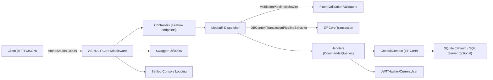
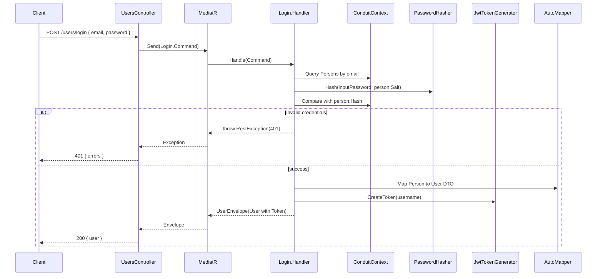
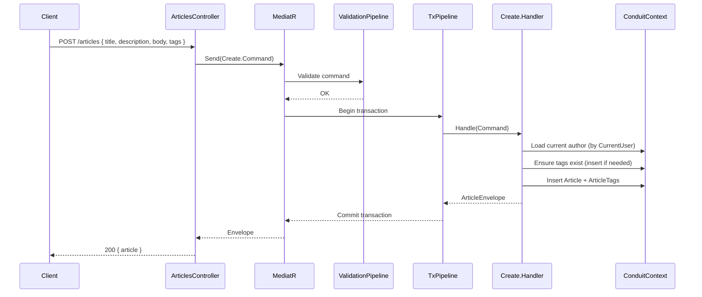
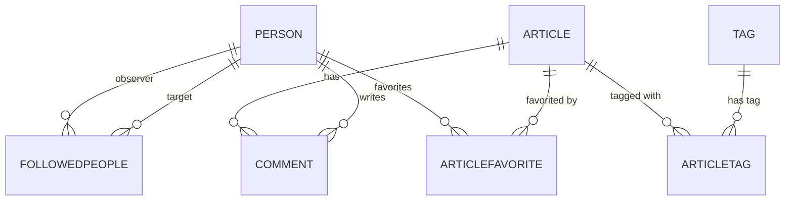
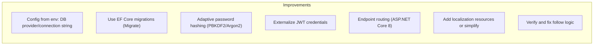

# Conduit Architecture Documentation

## 1. Architecture Overview
The Conduit backend is an ASP.NET Core Web API implementing the RealWorld "Conduit" specification. It provides user management, authentication, profiles, articles, comments, tags, and favorites via a RESTful interface. The codebase adopts a Clean Architecture-inspired, feature-oriented structure using CQRS with MediatR, Entity Framework Core for persistence, FluentValidation for validation, Serilog for logging, AutoMapper for object mapping, and Swagger for API documentation.

The primary goals are:
- Provide a clean, maintainable backend implementing the RealWorld API with thin controllers and feature-based vertical slices.
- Separate concerns between HTTP transport, request handling, domain logic, and data access using MediatR and pipeline behaviors.
- Offer a consistent and testable architecture with clear cross-cutting policies (validation, transactions, error handling, logging).

Key design decisions include:
- Vertically sliced feature folders (Users, Profiles, Articles, Comments, Favorites, Followers, Tags) that encapsulate commands/queries, handlers, DTOs, and controllers.
- CQRS via MediatR to decouple controllers from domain/persistence and to centralize cross-cutting concerns in pipeline behaviors.
- EF Core as the ORM with SQLite as the default provider; SQL Server is conditionally supported.
- JWT Bearer authentication integrated with the ASP.NET Core pipeline, adapted to RealWorld’s “Token <jwt>” header style.

## 2. System Context
The system exposes an HTTP REST API secured with JWT Bearer tokens. External clients (e.g., frontends, tools) interact over HTTP/JSON.

Internal modules and responsibilities:
- Web/API host (Program.cs): service registration, middleware pipeline, Swagger, CORS, database initialization.
- Infrastructure:
  - Persistence: ConduitContext (DbContext), EF Core configuration (relationships, transactions).
  - Cross-cutting: Validation and transaction pipeline behaviors, model-state validator filter, error handling middleware, grouping convention for Swagger tags.
  - Security: JWT issuance options, token generator, password hashing, current user accessor.
  - Utility: Slug generation.
- Domain: Entities for Person, Article, Comment, Tag, ArticleTag, ArticleFavorite, FollowedPeople.
- Features: Vertically organized features for Users, Profiles, Articles, Comments, Favorites, Followers, Tags. Each comprises requests (commands/queries), validators, handlers, envelopes (DTOs), and controllers.

External dependencies and frameworks:
- ASP.NET Core (Web API pipeline, MVC).
- MediatR (CQRS request/response and pipeline).
- EF Core (SQLite default, SQL Server supported, InMemory in tests).
- JWT Bearer Authentication.
- AutoMapper (mapping domain to API DTOs).
- FluentValidation (validators and pipeline behavior).
- Serilog (structured console logging).
- Swagger (Swashbuckle) for API documentation.

External clients interact by calling REST endpoints; authenticated endpoints expect an Authorization header that may contain “Token <jwt>” (translated to Bearer during authentication events).

## 3. High-Level Architecture
Architectural style: Clean Architecture-inspired, layered with vertical slices (feature folders) and CQRS via MediatR.

- Presentation layer: ASP.NET Core MVC controllers act as thin endpoints.
- Application layer: MediatR commands/queries with handlers embody the use cases. Cross-cutting concerns implemented as MediatR pipeline behaviors:
  - ValidationPipelineBehavior: executes FluentValidation validators.
  - DBContextTransactionPipelineBehavior: wraps handler execution in a database transaction.
- Domain layer: Plain domain entities (POCOs) with minimal logic and computed properties.
- Infrastructure layer: EF Core DbContext, transaction orchestration, security (JWT and password hashing), middleware (error handling), and utilities (slug).

Cross-cutting concerns:
- Logging: Serilog configured and attached to ILoggerFactory (console sink).
- Validation: FluentValidation via pipeline and ASP.NET MVC model-state ValidatorActionFilter (422 responses).
- Error handling: Global ErrorHandlingMiddleware producing JSON errors; uses localization infrastructure.
- Authentication/Authorization: JWT Bearer authentication with custom OnMessageReceived to handle “Token ...” header form; [Authorize] at controller/action level.
- CORS: Allow-all configured for simplicity.
- API docs: Swagger with security scheme for JWT and grouping via GroupByApiRootConvention.

Optional high-level diagram:

## 4. Modules / Components
- Program and Hosting (Program.cs):
  - Configures DbContext, localization, Swagger, CORS, MVC, authentication, and services via extension methods.
  - Builds middleware pipeline: ErrorHandlingMiddleware, CORS, Authentication, MVC, Swagger.
  - Ensures database creation on startup.

- ServicesExtensions:
  - AddConduit: Registers MediatR, pipeline behaviors, validators, AutoMapper, security services (PasswordHasher, JwtTokenGenerator, CurrentUserAccessor), ProfileReader, and IHttpContextAccessor.
  - AddJwt: Configures JwtIssuerOptions (signing key, issuer, audience) and JWT Bearer with a handler that recognizes “Token <jwt>”.
  - AddSerilogLogging: Sets up Serilog console logging (verbose) and attaches to ILoggerFactory.

- Infrastructure:
  - ConduitContext: EF Core DbContext with DbSets for Article, Comment, Person, Tag, ArticleTag, ArticleFavorite, FollowedPeople. Configures many-to-many and follow relationships (with SQL Server-specific delete behavior restrictions). Implements manual transaction lifecycle methods used by the transaction pipeline behavior.
  - Pipeline behaviors:
    - ValidationPipelineBehavior: Runs all FluentValidators for a request; throws ValidationException on failures.
    - DBContextTransactionPipelineBehavior: Begins a transaction, calls next handler, commits or rolls back appropriately (no transactions for InMemory provider).
  - MVC filters/conventions:
    - ValidatorActionFilter: Converts invalid ModelState to a standardized 422 JSON response with an { errors } object.
    - GroupByApiRootConvention: Groups controllers by their first route segment for Swagger tagging.
  - Errors:
    - ErrorHandlingMiddleware: Global exception handler; formats RestException and other exceptions into JSON; logs unhandled errors and uses localized messages for internal server error constant.
    - RestException: Exception carrying an HTTP status code and error payload.
  - Security:
    - JwtIssuerOptions, JwtTokenGenerator: Encapsulate JWT settings and token creation (sub, jti, iat, exp, signing).
    - IPasswordHasher/PasswordHasher: HMACSHA512-based hashing combined with per-user salt usage (salt is generated per user; hasher is keyed with a static key “realworld”).
    - ICurrentUserAccessor/CurrentUserAccessor: Reads current username from HTTP context claims.

- Domain:
  - Person, Article, Comment, Tag, ArticleTag, ArticleFavorite, FollowedPeople: Entities with navigation properties. Article has computed properties for Favorited, FavoritesCount, and TagList derived from relationships. Slug generation is provided via an extension method.

- Features (vertical slices):
  - Users: Create, Login, Edit, Details; UsersController (/users) and UserController (/user) with JWT protection on get/update current user. AutoMapper profile for Person->User mapping.
  - Articles: Create, List (including feed filtering by followed users), Details, Edit, Delete; ArticlesController (/articles). ArticleExtensions provides Include graph for EF queries.
  - Comments: Create, List, Delete; CommentsController nested under /articles/{slug}/comments.
  - Favorites: Add/Delete; FavoritesController under /articles/{slug}/favorite.
  - Followers: Add/Delete; FollowersController under /profiles/{username}/follow.
  - Profiles: Details and ProfileReader; ProfilesController (/profiles/{username}). Uses ProfileReader with current user context to set following flag.
  - Tags: List and TagsController (/tags).

Incoming/outgoing dependencies per feature follow a consistent pattern:
- Incoming: HTTP requests to controllers, dispatched to MediatR.
- Outgoing: Handlers access ConduitContext, security services (token generator/password hasher), current user accessor, and AutoMapper where needed.

## 5. Data Flow & Core Workflows
Request handling flow:
1. HTTP request enters ASP.NET Core Middleware pipeline.
2. ErrorHandlingMiddleware wraps execution and formats exceptions.
3. Authentication middleware parses token (including “Token ...” support) and sets user principal.
4. MVC dispatches to controller action based on route.
5. Controller constructs command/query and sends it via IMediator.
6. MediatR invokes pipeline behaviors:
   - ValidationPipelineBehavior runs validators.
   - DBContextTransactionPipelineBehavior starts a transaction (if supported).
7. Handler executes domain logic and persistence via ConduitContext.
8. Response DTO/envelope is returned to controller, serialized to JSON.
9. Swagger documentation is available under /swagger.

Sequence diagram: User Login

Sequence diagram: Article Create

## 6. Domain Model
Entities and relationships:
- Person: User account with Username, Email, Bio, Image, Hash, Salt. Relations: ArticleFavorites, Following, Followers.
- Article: Title, Description, Body, Author, Comments; computed Favorited, FavoritesCount, TagList; relations via ArticleFavorite and ArticleTag.
- Comment: Body, Author, Article, timestamps.
- Tag: Identified by TagId; relates to Article via ArticleTag.
- ArticleTag: Join entity between Article and Tag.
- ArticleFavorite: Join entity between Article and Person for “favorites”.
- FollowedPeople: Join entity representing follower/following relationships between Person and Person.

Domain diagram:

Key invariants and rules (as enforced in handlers/validators):
- Usernames and emails must be unique; creation checks for duplicates and returns 400 with specific errors.
- Login requires a matching hashed password using stored Salt and PasswordHasher.
- Authenticated operations (create/edit/delete article, follow/unfollow, favorite/unfavorite, post/delete comments) require a valid JWT.
- Editing articles recalculates the slug based on title and reconciles tags by computing additions and deletions.

## 7. Technology Choices & Rationale
- ASP.NET Core MVC: Mature HTTP pipeline, filters, and middleware support for REST APIs.
- MediatR (CQRS): Decouples endpoints from business logic; enables cross-cutting behaviors (validation, transactions) in a single place.
- EF Core: ORM for relational persistence with provider flexibility (SQLite default, SQL Server optional). Navigation and LINQ support fit the domain model.
- FluentValidation: Strongly-typed validation separate from controllers; integrated via pipeline for centralized enforcement.
- AutoMapper: Minimal mapping logic from domain to DTOs/envelopes.
- JWT Bearer Authentication: Standard token-based auth; OnMessageReceived hook accommodates RealWorld’s “Token <jwt>” header format.
- Serilog: Structured logging, console sink for local/dev debugging.
- Swagger (Swashbuckle): Built-in interactive documentation and testing.

## 8. Quality Attributes (Non-Functional Requirements)
- Scalability: Stateless application; can scale horizontally behind a load balancer. DB remains a potential bottleneck; EF Core and SQLite are not intended for high concurrency. Using SQL Server can improve scalability.
- Reliability: Transaction pipeline ensures data consistency within command handling. Global error handling ensures consistent error responses.
- Maintainability: Feature-based vertical slices keep concerns cohesive; CQRS handlers are small and focused. Cross-cutting behaviors are centralized.
- Testability: Vertical slices and MediatR simplify integration testing; a dedicated tests project uses InMemory provider or isolated DB contexts.
- Performance: Minimal overhead from MediatR; AutoMapper used lightly. Query Includes are explicit via ArticleExtensions. Slug generation is lightweight.
- Security: JWT Bearer auth; passwords hashed with HMACSHA512 and per-user salt. Note: The hasher uses a static key, and no adaptive hashing (PBKDF2/Argon2) is used. Tokens use symmetric signing with a hard-coded key in code.
- Extensibility: Adding features involves new handlers/controllers within feature folders. Additional cross-cutting behaviors can be added as pipeline behaviors.

## 9. Deployment View
Runtime environment:
- .NET 8.0 ASP.NET runtime container (mcr.microsoft.com/dotnet/aspnet:8.0).
- Two-stage Docker build:
  - Build stage runs bullseye build script (dotnet run on build/build.csproj) to publish.
  - Runtime stage copies published output and exposes port 8080.

Hosting and configuration:
- Swagger UI available at /swagger; JSON at /swagger/v1/swagger.json.
- CORS is allow-all.
- DB initialization uses EnsureCreated; no migrations are executed at startup.

Configuration management:
- Program.cs currently sets:
  - defaultDatabaseProvider = "sqlite"
  - defaultDatabaseConnectionString = "Filename=realworld.db"
- Comments refer to reading environment variables but are not currently wired to builder.Configuration or Environment variables.
- docker-compose.yml exposes environment variables:
  - ASPNETCORE_Conduit_DatabaseProvider
  - ASPNETCORE_Conduit_ConnectionString
  These are not consumed in the Program.cs at this time.
- launchSettings.json has DB_CONNECTION_STRING and DB_TYPE for local dev, which are also not consumed.

Assumptions and notes:
- No .env is present. The effective runtime uses SQLite with a file-based DB named realworld.db in the working directory unless the code is modified to read environment variables.

## 10. Gaps, Risks & Improvement Recommendations
Gaps and risks:
- Environment configuration: Although docker-compose sets environment variables for database provider/connection string, the application does not read them. This constrains deployments to SQLite unless code changes are made.
- Database initialization: Using EnsureCreated bypasses EF Core migrations. Schema evolution will be problematic across environments and upgrades.
- Password hashing: PasswordHasher uses HMACSHA512 with a static key and per-user salt. Consider adopting ASP.NET Core Identity’s password hasher or an adaptive hashing algorithm (PBKDF2, bcrypt, Argon2) with iteration/work factor.
- JWT configuration: Signing key, issuer, and audience are hard-coded in code. These should be sourced from secure configuration (environment variables, KeyVault).
- API routing & endpoint routing: MVC endpoint routing is disabled (EnableEndpointRouting = false) and UseMvc is used. Consider modernizing to endpoint routing for consistency with ASP.NET Core 8.
- Localization resources: ErrorHandlingMiddleware uses IStringLocalizer but no resource files are present. Either remove localization dependency for errors or add resources.
- Profile follow check: ProfileReader checks currentPerson.Followers for TargetId == person.PersonId. Verify this logic; typically following status is determined from currentPerson.Following, not Followers.
- Authorization breadth: Some read endpoints are open by design; confirm that all mutating endpoints are protected (they are marked with [Authorize] in controllers).

Recommended improvements:
- Wire configuration: Read database provider/connection string, JWT issuer/audience/signing key from configuration/environment variables (builder.Configuration.GetValue<string>(...) or options binding). Align names with docker-compose variables.
- Adopt EF Core migrations: Replace EnsureCreated with Migrate and maintain migrations to support schema changes.
- Strengthen password hashing: Replace custom hasher with ASP.NET Core Identity password hasher or use PBKDF2/Argon2 with per-user salts and configurable iterations.
- Token settings: Externalize JWT settings and rotate keys securely. Consider token lifetime and refresh strategies if needed.
- Update to endpoint routing: Replace UseMvc with MapControllers/UseRouting/UseEndpoints.
- Add resource files if localization is intentional, or simplify error messages without localization.
- Validate follow logic in ProfileReader and adjust to use currentPerson.Following to determine “following” status.

## Appendix: API Surface (from code)
- Users: POST /users, POST /users/login, GET /user (JWT), PUT /user (JWT)
- Profiles: GET /profiles/{username}
- Followers: POST /profiles/{username}/follow (JWT), DELETE /profiles/{username}/follow (JWT)
- Articles: GET /articles, GET /articles/feed (JWT), GET /articles/{slug}, POST /articles (JWT), PUT /articles/{slug} (JWT), DELETE /articles/{slug} (JWT)
- Comments: GET /articles/{slug}/comments, POST /articles/{slug}/comments (JWT), DELETE /articles/{slug}/comments/{id} (JWT)
- Favorites: POST /articles/{slug}/favorite (JWT), DELETE /articles/{slug}/favorite (JWT)
- Tags: GET /tags
