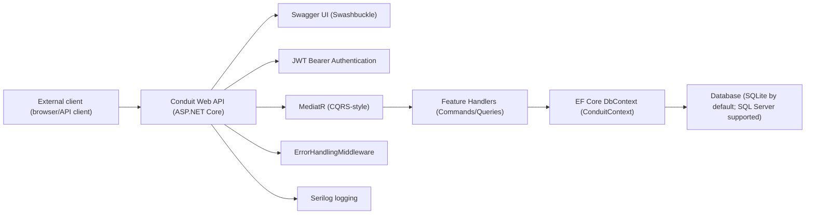
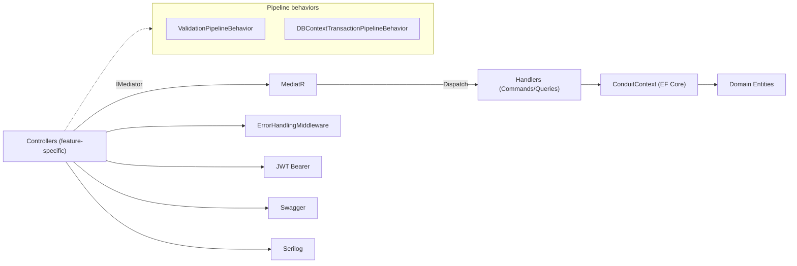
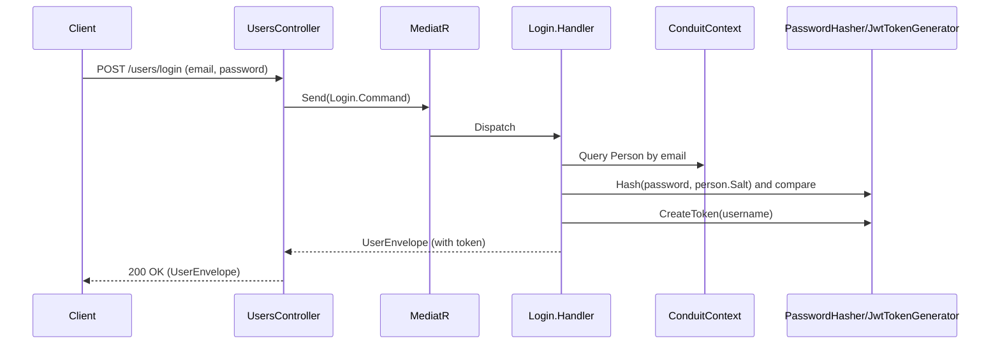
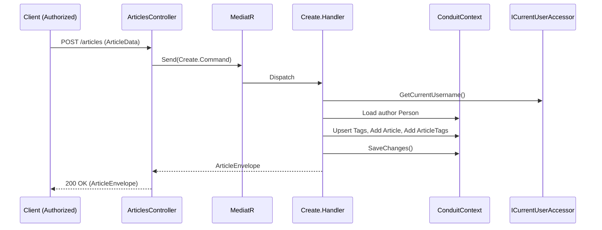
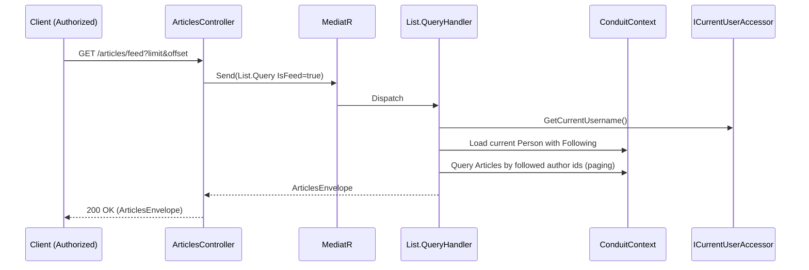
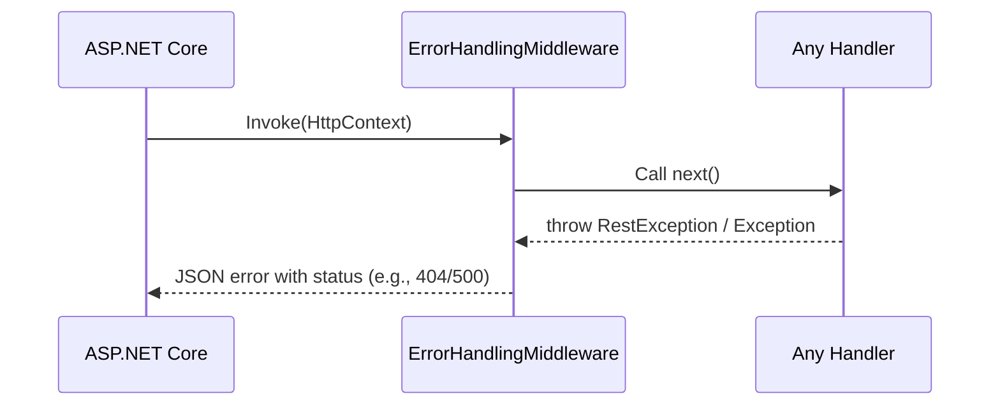
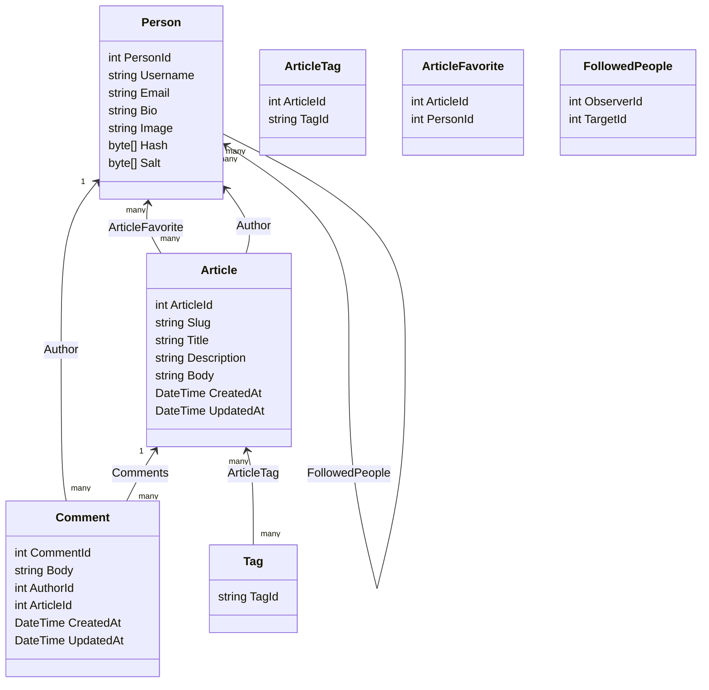
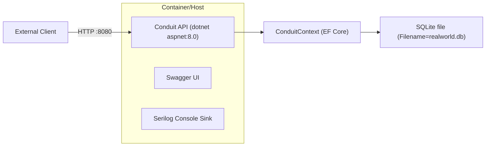

# Architecture Documentation - Conduit ASP.NET Core RealWorld API

## Architecture Overview
This repository implements a backend Web API for the RealWorld Conduit domain using ASP.NET Core 8. The code is organized as vertical feature slices with CQRS-style request/response handling powered by MediatR. Controllers are intentionally thin and delegate all work to request handlers. The system exposes HTTP endpoints for users, current user, profiles, followers, articles, comments, favorites, and tags. Data access is implemented via Entity Framework Core with a DbContext named ConduitContext. JSON responses use envelope objects in several features to shape API responses.

The problem domain centers on a publishing platform where users can register/login, manage profiles and follow relationships, create and edit articles, tag and favorite articles, and manage comments. The current code implements these behaviors along with validation, error handling, authentication, and Swagger documentation.

Important note on completeness: While docker-compose and launch settings suggest environment-driven database configuration, Program.cs currently uses hard-coded defaults for provider ("sqlite") and connection string ("Filename=realworld.db"). The environment variables present in docker-compose and launchSettings.json are not read at runtime by Program.cs. Also, the Dockerfile invokes a build project (build/build.csproj) that is not present in this repository, implying a gap for container publishing.

## System Context
This service is a standalone HTTP API consumed by external clients (browsers, API clients). It uses:
- ASP.NET Core for hosting, MVC, routing, and middleware.
- MediatR for dispatching commands and queries.
- FluentValidation for validation via a pipeline behavior and an MVC action filter.
- Entity Framework Core for persistence (SQLite by default; SQL Server alternative supported via code path).
- AutoMapper for mapping domain entities to DTOs.
- JWT Bearer authentication for security, with a custom message receiver accepting "Token " prefixes.
- Serilog for logging.
- Swashbuckle for Swagger/OpenAPI generation.

External interaction is limited to HTTP clients and a database accessed via EF Core.

External clients interact strictly via HTTP endpoints exposed by controllers. Authentication is handled by ASP.NET Core JWT middleware configured in ServicesExtensions.AddJwt.

## High-Level Architecture
The architecture follows a layered, vertically sliced pattern:
- API Layer: Controllers per feature (Users, User, Profiles, Followers, Articles, Comments, Favorites, Tags). Controllers are thin and only translate HTTP requests to MediatR calls.
- Application Layer: Feature folders implement Commands/Queries, Validators, and Handlers. Pipeline behaviors add validation and database transaction boundaries.
- Infrastructure Layer: EF Core DbContext (ConduitContext), security (JWT token generation, password hashing), HTTP context access, pipeline behaviors, error handling middleware, action filter, and MVC controller convention.
- Domain Layer: Entities (Article, Person, Comment, Tag, ArticleTag, ArticleFavorite, FollowedPeople).

Cross-cutting concerns:
- Validation: FluentValidation via ValidationPipelineBehavior and ValidatorActionFilter.
- Transaction management: DBContextTransactionPipelineBehavior ensures each request runs in a transaction when not using InMemory provider.
- Error handling: ErrorHandlingMiddleware maps exceptions (RestException) to structured JSON errors.
- Authentication & authorization: JWT Bearer configured in AddJwt; controllers use [Authorize] with JwtIssuerOptions.Schemes.
- Logging: Serilog configured via ILoggerFactory extension.
- Documentation: Swagger with JWT security definition.

## Modules / Components
This section describes the modules present. Only code that exists in the repository is documented.

### Users Module (registration and login)
Purpose: User creation and authentication.
Key classes/files: Features/Users/Create.cs, Login.cs, Details.cs, Edit.cs, MappingProfile.cs, User.cs, UsersController.cs, UserController.cs.
Responsibilities: Register users, login, fetch current user, edit current user.
Interactions: Uses ConduitContext for Person persistence; uses IPasswordHasher and IJwtTokenGenerator; maps Person to User DTO using AutoMapper.
Dependencies in: Controllers; other features through current user.
Dependencies out: EF Core, PasswordHasher, JwtTokenGenerator, AutoMapper, ICurrentUserAccessor.

API Endpoints:
- POST /users — create user; body Create.Command; returns UserEnvelope.
- POST /users/login — login; body Login.Command; returns UserEnvelope.
- GET /user — authorized; returns current user details via Details.Query with current username.
- PUT /user — authorized; updates current user via Edit.Command; returns UserEnvelope.

### Profiles Module (read-only profiles)
Purpose: Expose user profiles with follow status.
Key classes/files: ProfilesController.cs, Details.cs, IProfileReader.cs, ProfileReader.cs, MappingProfile.cs, Profile.cs, ProfileEnvelope.cs.
Responsibilities: Fetch a profile by username; compute following status for current user.
Interactions: Reads Persons and follow relationships; uses ICurrentUserAccessor; maps Person to Profile.
Endpoint:
- GET /profiles/{username} — returns ProfileEnvelope.

### Followers Module
Purpose: Follow/unfollow users.
Key classes/files: FollowersController.cs, Add.cs, Delete.cs.
Responsibilities: Create or delete FollowedPeople relationships.
Interactions: Uses ConduitContext.FollowedPeople; reuses IProfileReader to return updated profile.
Endpoints:
- POST /profiles/{username}/follow — authorized; follow a user; returns ProfileEnvelope.
- DELETE /profiles/{username}/follow — authorized; unfollow a user; returns ProfileEnvelope.

### Articles Module
Purpose: CRUD and listing for articles.
Key classes/files: ArticlesController.cs, Create.cs, Edit.cs, Delete.cs, Details.cs, List.cs, ArticleEnvelope.cs, ArticlesEnvelope.cs, ArticleExtensions.cs.
Responsibilities: Create/edit/delete articles; list articles and feed; fetch article details; handle tag relationships.
Interactions: Uses ConduitContext; Slug.GenerateSlug; ICurrentUserAccessor; EF includes via ArticleExtensions.GetAllData.
Endpoints:
- GET /articles?tag=&author=&favorited=&limit=&offset= — list articles (filters supported).
- GET /articles/feed?tag=&author=&favorited=&limit=&offset= — list feed for current user (authorized at handler via current user presence).
- GET /articles/{slug} — article details.
- POST /articles — authorized; create; returns ArticleEnvelope.
- PUT /articles/{slug} — authorized; update; returns ArticleEnvelope.
- DELETE /articles/{slug} — authorized; delete; no response body.

### Comments Module
Purpose: Manage article comments.
Key classes/files: CommentsController.cs, Create.cs, Delete.cs, List.cs, CommentEnvelope.cs, CommentsEnvelope.cs.
Responsibilities: Create, list, and delete comments for a specific article.
Interactions: Uses ConduitContext; ICurrentUserAccessor.
Endpoints:
- POST /articles/{slug}/comments — authorized; create comment; returns CommentEnvelope.
- GET /articles/{slug}/comments — list comments; returns CommentsEnvelope.
- DELETE /articles/{slug}/comments/{id} — authorized; delete a comment.

### Favorites Module
Purpose: Favorite/unfavorite articles.
Key classes/files: FavoritesController.cs, Add.cs, Delete.cs.
Responsibilities: Create or remove ArticleFavorite; return updated article envelope.
Interactions: Uses ConduitContext.ArticleFavorites; ICurrentUserAccessor.
Endpoints:
- POST /articles/{slug}/favorite — authorized; favorite article; returns ArticleEnvelope.
- DELETE /articles/{slug}/favorite — authorized; unfavorite article; returns ArticleEnvelope.

### Tags Module
Purpose: Retrieve tags.
Key classes/files: TagsController.cs, List.cs, TagsEnvelope.cs.
Responsibilities: Return ordered tag list.
Endpoint:
- GET /tags — returns TagsEnvelope.

### Infrastructure and Cross-Cutting
- ConduitContext: EF Core DbContext with DbSets for Article, Comment, Person, Tag, ArticleTag, ArticleFavorite, FollowedPeople; composite keys and relationships configured; transaction helpers (BeginTransaction/CommitTransaction/RollbackTransaction).
- Pipeline behaviors: ValidationPipelineBehavior and DBContextTransactionPipelineBehavior.
- Middleware: ErrorHandlingMiddleware to convert exceptions to JSON; ValidatorActionFilter to return 422 responses for invalid model state.
- Security: JwtIssuerOptions, JwtTokenGenerator, PasswordHasher; ICurrentUserAccessor resolves current username from claims; AddJwt wires the middleware and accepts "Token " headers.
- MVC convention: GroupByApiRootConvention groups Swagger endpoints by route root.

## Data Flow & Core Workflows
The project employs MediatR to route requests from controllers to handlers. Validation and transaction behaviors wrap handler execution; error handling middleware wraps the entire HTTP pipeline.

### Workflow: User Login

### Workflow: Create Article

### Workflow: List Articles (Feed)

### Workflow: Error Handling

## Domain Model
Entities and relationships implemented in the Domain folder and configured in ConduitContext.OnModelCreating.

Note: Favorited and TagList are computed (NotMapped) properties on Article. Many-to-many relationships are materialized via join entities ArticleTag and ArticleFavorite. FollowedPeople models person-to-person following.

## Technology Choices & Rationale
- ASP.NET Core: Host Web API with middleware, routing, and dependency injection.
- MediatR: Implements CQRS-style separation, enabling thin controllers and testable handlers.
- FluentValidation: Centralized validation via pipeline behavior and action filter yielding 422 responses.
- EF Core: ORM for persistence; uses SQLite by default with optional SQL Server; AsNoTracking in read paths to improve query performance.
- AutoMapper: Maps domain entities (Person) to transport models (User, Profile).
- JWT Bearer Authentication: Security scheme with token validation parameters; OnMessageReceived parses "Token " header in addition to Bearer format.
- Serilog: Structured logging with console sink during development.
- Swashbuckle (Swagger): API documentation, security definitions for JWT, operation grouping via GroupByApiRootConvention.

Rationale is inferred from code organization and usage patterns. Assumptions: console sink and verbose logging are development defaults.

## Quality Attributes
- Maintainability: Vertical slices by feature, thin controllers, and pipeline behaviors reduce coupling. Warnings-as-errors and code analysis are enabled in Directory.Build.props.
- Testability: Handlers are separated from controllers; integration tests use EF Core InMemory provider and MediatR. Stubs are used for current user access.
- Performance: Read operations use AsNoTracking. Filtering and pagination are implemented at the database level. Transactions are scoped per request (non-InMemory).
- Security: JWT-based authentication. Passwords hashed with HMACSHA512 plus per-user salt. However, signing key and issuer/audience are hard coded in AddJwt, and CORS is open (AllowAnyOrigin).
- Reliability: Transaction pipeline ensures consistency on handler failures. ErrorHandlingMiddleware provides consistent error responses.
- Observability: Serilog logging is wired into ILoggerFactory.

## Deployment View
Runtime:
- .NET 8 application (TargetFramework net8.0).
- Kestrel-hosted Web API.

Containerization:
- Dockerfile uses multi-stage build. It runs dotnet run --project build/build.csproj -- publish to produce publish artifacts, then copies them into an aspnet runtime image and exposes port 8080 with ENTRYPOINT ["dotnet", "Conduit.dll"].
- docker-compose maps host 8080 to container 8080 and sets two environment variables (ASPNETCORE_Conduit_DatabaseProvider and ASPNETCORE_Conduit_ConnectionString).

Configuration:
- Program.cs wires the DbContext using hard-coded defaults (provider "sqlite" and connection string "Filename=realworld.db"). The environment variables referenced in docker-compose or launchSettings.json are not read at runtime in the current code. Swagger is served at /swagger/v1/swagger.json with UI enabled.

Assumptions: The referenced build project (build/build.csproj) is part of a separate build system or missing from this snapshot; the service runs on port 8080 in container as coded in Dockerfile.

## Gaps, Risks & Improvement Recommendations
- Environment-driven configuration: Program.cs ignores environment variables for database provider and connection string. Recommendation: bind provider/connection string from configuration (appsettings/environment) and remove hard-coded defaults.
- Docker build: Dockerfile references build/build.csproj which is not present. Recommendation: provide the build project or switch to standard dotnet publish for the Conduit project in the Dockerfile.
- Security configuration: AddJwt uses a hard-coded symmetric key, issuer, and audience, and permits "Token " prefix in Authorization header. Recommendation: load signing key and validation parameters from configuration secrets; consider limiting accepted header formats to canonical Bearer usage.
- CORS: AllowAnyOrigin/AnyHeader/AnyMethod is permissive. Recommendation: restrict origins and methods per environment.
- Token lifetime: JwtIssuerOptions.ValidFor defaults to 5 minutes. Validate appropriateness for the product requirements.
- Error localization: ErrorHandlingMiddleware references IStringLocalizer but resource strings are not shown; ensure resources exist or fallback messages are acceptable.
- Follow status computation: ProfileReader checks currentPerson.Followers for target id; verify logic matches business rules (often "Following" collection is used to check if current follows target).
- DB transactions: Pipeline behavior skips transactions for InMemory provider; confirm transactional semantics for other providers meet requirements.

All assumptions in this section are explicitly labeled as such and grounded in the current code where visible.

