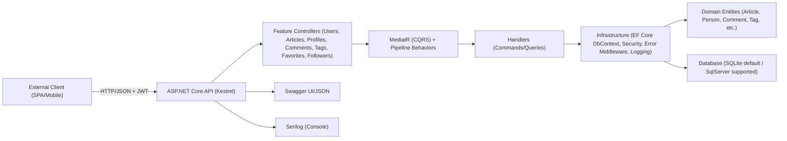
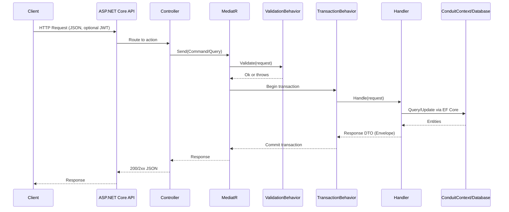
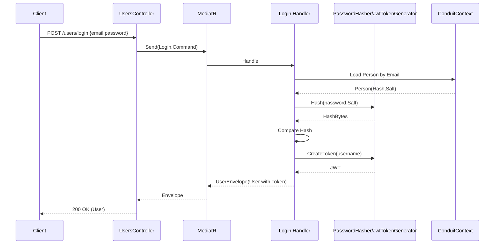

# Conduit (ASP.NET Core) Architecture Documentation

## Architecture Overview
Conduit is an ASP.NET Core Web API implementation of the RealWorld “Conduit” specification that models a medium-like blogging platform. The codebase is organized into feature-oriented vertical slices (Users, Profiles, Articles, Comments, Tags, Favorites, Followers). Each slice encapsulates its commands/queries, validation, and request handlers using the CQRS pattern with MediatR, resulting in thin controllers. Persistence is implemented with Entity Framework Core using an EF Core DbContext (ConduitContext). Authentication is JSON Web Token (JWT) based and enforced via standard ASP.NET Core authentication middleware.

The solution exposes REST endpoints grouped by root route segments (e.g., /users, /articles, /profiles) and provides Swagger documentation and UI. Logging is configured using Serilog with a console sink. Validation is applied in two places: MediatR pipeline validation with FluentValidation and MVC model validation via a custom ValidatorActionFilter.

At startup, the application configures EF Core with a default SQLite connection string (“Filename=realworld.db”) and a default provider (“sqlite”), then ensures the database is created. JWT settings (issuer, audience, key) are currently set in code, not from configuration. Docker and docker-compose are provided, with the container exposing port 8080.

Assumptions where relevant pieces are implicit or incomplete:
- JWT signing key, issuer, and audience are intended to be configurable via environment variables or appsettings but are currently hard-coded.
- Environment variable names for DB provider/connection (used in docker-compose and launchSettings) are intended for use at runtime but are not wired in Program.cs; the existing code uses hard-coded defaults.
- Identity claims mapping from tokens to HttpContext.User is expected to yield a NameIdentifier claim for the current username, but the token generator only sets the “sub” claim; mapping to ClaimTypes.NameIdentifier is not shown. This may require a custom claim mapping to ensure current user access works through ICurrentUserAccessor in production.

## System Context
Conduit is a backend REST API consumed by external clients such as SPAs or mobile apps. External actors interact with HTTP endpoints, optionally providing JWT Bearer tokens for authenticated operations (article creation, comments, follow/unfollow, favorites, editing). The system persists data via EF Core and uses the configured database provider (SQLite by default; SqlServer supported). Swagger is available for documentation and exploration. Logging uses Serilog to console for observability during development and runtime.

External dependencies and integrations discovered in the codebase:
- ASP.NET Core Web API middleware pipeline and MVC routing/controllers.
- MediatR for CQRS request handling and pipeline behaviors.
- EF Core with providers: SQLite and SqlServer, plus in-memory for tests.
- AutoMapper for mapping domain entities to response DTOs.
- FluentValidation for command/query validation.
- Swashbuckle.AspNetCore (Swagger) for API documentation.
- Serilog for structured logging (console sink).
- JWT Bearer authentication (Microsoft.AspNetCore.Authentication.JwtBearer).

Clients interact via:
- Public REST endpoints under routes like /users, /user, /profiles, /articles, /tags, with JWT required on protected routes (as enforced by [Authorize(AuthenticationSchemes = JwtIssuerOptions.Schemes)] attributes).
- Swagger at /swagger with a Bearer scheme configured for supplying tokens.

## High-Level Architecture
The architecture follows a Clean/vertical-slice style built on CQRS:

- Presentation layer: ASP.NET Core controllers in feature folders (e.g., UsersController, ArticlesController). Controllers remain thin and delegate to MediatR.
- Application layer: Feature slices each implement commands/queries, validators, handlers, and response envelopes. Cross-cutting behaviors are implemented as MediatR pipeline behaviors (ValidationPipelineBehavior and DBContextTransactionPipelineBehavior).
- Domain layer: Rich domain entities (Article, Person, Comment, Tag, ArticleTag, ArticleFavorite, FollowedPeople) hold state and simple computations (e.g., Favorited, FavoritesCount, TagList).
- Infrastructure layer: EF Core DbContext (ConduitContext) and configurations, transaction handling, error handling middleware, security (JWT generation, password hashing), user context accessor, route-to-swagger grouping convention, and MVC validator filter.

Cross-cutting concerns:
- Authentication/Authorization: JWT Bearer authentication via AddJwt extension. Controllers decorate protected endpoints with [Authorize].
- Validation: FluentValidation applied via MediatR pipeline; MVC also uses ValidatorActionFilter to respond with 422 on invalid ModelState.
- Transactions: DBContextTransactionPipelineBehavior wraps each request in a transaction (except when using in-memory provider).
- Error handling: ErrorHandlingMiddleware converts RestException into standardized status codes and messages; unknown errors return generic 500 JSON.
- Logging: Serilog console sink via ILoggerFactory.AddSerilogLogging.
- Configuration: Hard-coded defaults in Program.cs; Swagger configured with a Bearer security definition; CORS allows any origin.

Mermaid high-level component view:



## Module and Component Analysis

### Controllers (Presentation)
Purpose: Define REST endpoints, parse parameters, and delegate to MediatR. Controllers are intentionally thin and do not contain business logic.

Key classes:
- UsersController (/users): POST /users (register), POST /users/login (authenticate).
- UserController (/user): GET /user (current user), PUT /user (update). Protected via JWT.
- ProfilesController (/profiles): GET /profiles/{username}.
- FollowersController (/profiles/{username}/follow): POST follow, DELETE unfollow. Protected via JWT.
- ArticlesController (/articles): GET list, GET feed, GET details, POST create, PUT edit, DELETE delete. Auth required on mutating operations.
- CommentsController (/articles/{slug}/comments): POST create, GET list, DELETE comment. Protected for create/delete.
- FavoritesController (/articles/{slug}/favorite): POST add favorite, DELETE remove favorite. Protected.

Implemented vs missing:
- All RealWorld core endpoints appear implemented for users, profiles, articles, comments, tags, favorites, and followers. Feed endpoint exists at /articles/feed.
- Controllers rely on group-by-route convention for Swagger grouping.

Dependencies:
- IMediator (MediatR) to send commands/queries.
- JwtIssuerOptions.Schemes for [Authorize] attributes where required.

### Application (Feature Slices with CQRS)
Purpose: Encapsulate use cases as commands/queries with validators and handlers per feature.

Representative slices:
- Users: Create, Login, Details (current user by username), Edit (update user). AutoMapper maps Person to response User DTO. PasswordHasher generates salted hashes. JWT token issued at create/login.
- Profiles: Details (via IProfileReader abstraction). ProfileReader maps Person to Profile and determines following status based on FollowedPeople.
- Followers: Add/Remove follower relationships (FollowedPeople join).
- Articles: List (with filtering and feed), Details, Create, Edit (including tag changes with ArticleTag), Delete.
- Comments: Create, List, Delete associated with article.
- Tags: List (returns tag string values sorted).

Dependencies:
- ConduitContext for persistence.
- ICurrentUserAccessor to determine current username for auth-protected operations.
- IPasswordHasher, IJwtTokenGenerator, AutoMapper where appropriate.
- FluentValidation validators per command/query used in ValidationPipelineBehavior.

Assumptions of intended behavior:
- MediatR validators intended to return 422-like responses; however, ValidationException is not explicitly mapped by ErrorHandlingMiddleware. In practice, MVC model state is mapped to 422 via ValidatorActionFilter; for MediatR pipeline validation, the current middleware will treat unhandled exceptions as 500. This is likely intended to be improved to return 422 for validation errors.
- Current user retrieval relies on a NameIdentifier claim. The JWT generator sets “sub”; mapping from “sub” to ClaimTypes.NameIdentifier may need explicit configuration.

### Domain (Entities)
Purpose: Model core domain concepts and relationships.

Key entities:
- Person: Username, Email, Bio, Image, Hash, Salt; navigation collections for ArticleFavorites, Following, Followers.
- Article: Slug, Title, Description, Body, Author, Comments, computed Favorited/FavoritesCount/TagList; relations to ArticleTag and ArticleFavorite; timestamps.
- Comment: Body, Author, Article, timestamps.
- Tag: TagId (string), many-to-many via ArticleTag.
- ArticleTag: join entity (ArticleId, TagId).
- ArticleFavorite: join entity (ArticleId, PersonId).
- FollowedPeople: self-join entity for follow relationships (ObserverId, TargetId) with delete behavior restrictions to avoid cascade cycles.

Dependencies:
- EF Core mappings configured in ConduitContext.OnModelCreating for composite keys and delete behaviors.

### Infrastructure
Purpose: Provide persistence, security, error handling, conventions, and cross-cutting behaviors.

Key classes:
- ConduitContext: EF Core DbContext, DbSets for domain entities, relationship configuration, and transaction hooks (Begin/Commit/Rollback) active for non-in-memory providers.
- Security: IJwtTokenGenerator/JwtTokenGenerator (creates tokens using JwtIssuerOptions), IPasswordHasher/PasswordHasher (HMACSHA512 with salt), JwtIssuerOptions (issuer, audience, lifetime, signing credentials).
- User context: ICurrentUserAccessor/CurrentUserAccessor reading ClaimTypes.NameIdentifier from HttpContext.
- Pipeline behaviors: ValidationPipelineBehavior<T>, DBContextTransactionPipelineBehavior<T>.
- Errors: RestException for controlled errors; ErrorHandlingMiddleware converts RestException codes to JSON responses and logs unhandled exceptions; Constants for error strings.
- MVC: ValidatorActionFilter returns 422 on invalid ModelState; GroupByApiRootConvention groups controllers by first route segment for Swagger.

### Configuration and Startup
- Program.cs: Registers DbContext with provider selection (sqlite/sqlserver) based on hard-coded defaults; adds localization, Swagger with Bearer, CORS, MVC with conventions and ValidatorActionFilter; adds Conduit services and JWT; configures Serilog; adds middleware pipeline (ErrorHandling, CORS, Authentication, MVC, Swagger); ensures database is created at startup (EnsureCreated).
- ServicesExtensions: AddConduit registers MediatR, validators, AutoMapper, security services, current user accessor, and IHttpContextAccessor; AddJwt configures JwtBearer authentication with a hard-coded symmetric key, issuer, audience, and message received hook supporting “Token ” header prefix; AddSerilogLogging configures console logging.

## Data Flow and Core Workflows

### Request Flow (Typical)
- HTTP request reaches Kestrel and passes through middleware (ErrorHandlingMiddleware, CORS, Authentication).
- MVC routing invokes a controller action. The controller constructs a command/query and sends it through IMediator.
- MediatR pipeline runs ValidationPipelineBehavior and DBContextTransactionPipelineBehavior, then executes the handler.
- Handler performs data access using ConduitContext, uses domain entities, security helpers (e.g., password hashing, token generation), and mapping when needed.
- Handler returns an envelope DTO, which the controller serializes to JSON.
- ErrorHandlingMiddleware converts RestException into structured error responses; unhandled exceptions become 500 errors.

Mermaid sequence diagram of the general flow:



### User Authentication (Login)
- UsersController receives POST /users/login, sends Login.Command to MediatR.
- Handler validates credentials by hashing the supplied password with stored salt and comparing.
- On success, issues JWT via JwtTokenGenerator and maps Person to User DTO.



### Article Create/Edit/Delete
- Authenticated client creates an article via POST /articles; handler uses current user, creates Article, associates tags (creating tags if needed), saves and returns envelope.
- Edit updates fields, regenerates slug, computes tag changes, updates UpdatedAt.
- Delete removes the article.

```mermaid
sequenceDiagram
  participant C as Client (JWT)
  participant CTRL as ArticlesController
  participant MED as MediatR
  participant H as Create.Handler
  participant ACC as CurrentUserAccessor
  participant DB as ConduitContext

  C->>CTRL: POST /articles {title,body,description,tagList}
  CTRL->>MED: Send(Create.Command)
  MED->>H: Handle
  H->>ACC: GetCurrentUsername()
  ACC-->>H: username
  H->>DB: Load Author (Person)
  DB-->>H: Person
  H->>DB: Upsert Tags; Add Article; Add ArticleTags
  DB-->>H: SaveChanges
  H-->>MED: ArticleEnvelope(Article)
  MED-->>CTRL: Envelope
  CTRL-->>C: 201 Created (Article)
```

### Comments Create/List/Delete
- Authenticated client posts a comment to /articles/{slug}/comments.
- Handler loads article and current user, adds comment, saves, and returns envelope.
- List loads article with comments and authors.
- Delete removes a comment by id.

```mermaid
sequenceDiagram
  participant C as Client (JWT for create/delete)
  participant CTRL as CommentsController
  participant MED as MediatR
  participant H as Comments.Create.Handler
  participant ACC as CurrentUserAccessor
  participant DB as ConduitContext

  C->>CTRL: POST /articles/{slug}/comments {body}
  CTRL->>MED: Send(Create.Command)
  MED->>H: Handle
  H->>DB: Load Article by Slug (with Comments)
  DB-->>H: Article
  H->>ACC: GetCurrentUsername()
  ACC-->>H: username
  H->>DB: Load Author (Person)
  DB-->>H: Person
  H->>DB: Add Comment; SaveChanges
  H-->>MED: CommentEnvelope(Comment)
  MED-->>CTRL: Envelope
  CTRL-->>C: 201 Created (Comment)
```

## Domain Model
Entities discovered and relationships:
- Person has many ArticleFavorites; Person has many Followers and Following via FollowedPeople join; holds hashed password and salt.
- Article belongs to Person (Author), has many Comments; has many Tags via ArticleTag join; can be favorited by many Persons via ArticleFavorite.
- Comment belongs to Article and Person (Author).
- Tag has many ArticleTags to relate with Articles.
- FollowedPeople joins Person to Person for follower/following, with delete behavior restrictions to avoid cascades.

Key invariants and behaviors:
- Article.TagList is derived from ArticleTags and not persisted directly.
- Favorited and FavoritesCount are computed from ArticleFavorites.
- Slug for Article is generated from title using a helper that slugifies and truncates to 45 chars.
- Follow relationships are unique by ObserverId/TargetId (composite key).

Assumptions:
- Email and Username uniqueness are enforced at application level in handler logic; database-level unique constraints are not shown.
- Claim-based authentication assumes a claim for NameIdentifier exists for the current user; token currently sets sub only.
- Data migrations are not used; database creation relies on EnsureCreated at startup.

## Technology Choices and Rationale
- ASP.NET Core Web API: Modern, performant, and cross-platform HTTP framework with middleware and DI built-in; ideal for REST services.
- MediatR (CQRS): Promotes separation of concerns and encapsulation of use cases; yields thin controllers and composable pipeline behaviors for validation and transactions.
- Entity Framework Core: Mature ORM for .NET; providers for SQLite (simple dev/testing), SqlServer (production), and InMemory (tests).
- AutoMapper: Simplifies mapping from domain entities to DTOs/envelopes with minimal boilerplate.
- FluentValidation: Declarative and testable validation; integrated both with MVC ModelState and MediatR.
- Swashbuckle/Swagger: Auto-generates OpenAPI specs and provides UI to explore and test endpoints.
- Serilog: Structured logging with flexible sinks; console sink configured for easy dev diagnostics.
- JWT Bearer Authentication: Standard token-based auth for stateless APIs; integrates with ASP.NET Core authentication pipeline.

## Quality Attributes
- Scalability: Stateless API with JWT fits horizontal scaling. EF Core with SQLite is not ideal for high-scale; SqlServer provider is supported and appropriate for scaling. The absence of caching may limit read scalability for large datasets.
- Performance: EF Core AsNoTracking is used for queries to reduce overhead; computed fields avoid extra joins when possible. Console logging may be chatty; structured sinks can be tuned.
- Maintainability: Vertical slices isolate features; MediatR handlers are cohesive. Clear separation of infrastructure, domain, and features improves comprehension.
- Testability: InMemory EF Core and helpers in integration tests demonstrate testability of features. Pipeline behaviors and handlers are easy to test in isolation.
- Security: JWT auth enforced on protected endpoints. Hard-coded JWT key/issuer/audience is a risk; claims mapping for current user may be incorrect. Passwords are hashed with a salted HMACSHA512 approach; consider upgrading to a password hashing algorithm with built-in work factor (PBKDF2/Argon2/bcrypt).
- Extensibility: Feature slices allow adding new functionality (e.g., additional endpoints) without cross-cutting code changes. Pipeline behaviors can add logging/metrics/retry/circuit-breakers as needed.

## Deployment View
- Runtime: ASP.NET Core app runs on Kestrel. Dockerfile builds with .NET SDK 8.0 and runs with ASP.NET Core runtime 8.0, exposing port 8080.
- Configuration: 
  - Program.cs currently uses hard-coded defaults for DB provider (“sqlite”) and connection string (“Filename=realworld.db”).
  - docker-compose.yml passes environment variables ASPNETCORE_Conduit_DatabaseProvider and ASPNETCORE_Conduit_ConnectionString to the service, but Program.cs does not read them yet.
  - Properties/launchSettings.json includes DB_CONNECTION_STRING and DB_TYPE for local runs. These names also do not match the variables in docker-compose or in Program.cs.
  - JWT settings (issuer, audience, signing key) are set in code inside AddJwt and JwtIssuerOptions.
- Database: Database is created at startup with EnsureCreated; EF Core migrations are not invoked. For production, migrations are recommended instead of EnsureCreated.
- API Documentation: Swagger JSON exposed at /swagger/v1/swagger.json and UI at /swagger.
- Ports: Container exposes 8080; docker-compose maps 8080:8080. If a different preview port (e.g., 3001) is required in a broader environment, adjust docker-compose port mapping accordingly.

Assumptions for ops:
- Environment variables will be used to supply database provider/connection and JWT secret/issuer/audience in production.
- CI/CD can run tests against InMemory provider, then publish/push container artifacts leveraging Dockerfile’s publish stage.

## Gaps, Risks and Improvements

Gaps/Risks identified:
- Environment variable mismatch:
  - docker-compose: ASPNETCORE_Conduit_DatabaseProvider, ASPNETCORE_Conduit_ConnectionString.
  - launchSettings: DB_CONNECTION_STRING, DB_TYPE.
  - Program.cs: hard-coded defaults; commented lines suggest env usage but not implemented.
  Improvement: Read provider/connection from configuration/environment and unify variable names.

- JWT configuration is hard-coded:
  - Signing key, issuer, audience are defined in code. This is a security risk.
  Improvement: Load from environment or configuration; rotate keys securely.

- Claims mapping for current user:
  - CurrentUserAccessor reads ClaimTypes.NameIdentifier; JwtTokenGenerator issues “sub” only.
  Risk: In production, current user may be null unless claims mapping translates sub -> NameIdentifier.
  Improvement: Map claims explicitly by adding Claim(ClaimTypes.NameIdentifier, username) or configuring inbound claim type mapping.

- Validation exception handling:
  - ValidationPipelineBehavior throws FluentValidation.ValidationException which is not handled specifically by ErrorHandlingMiddleware, resulting in default 500.
  Improvement: Catch ValidationException in middleware and return 422 with details.

- Database initialization:
  - EnsureCreated is used; no migrations are defined or applied.
  Risk: Schema drift and upgrade difficulties.
  Improvement: Add EF Core migrations and apply them at startup or during deployment.

- Authorization checks beyond authentication:
  - Endpoints are protected by [Authorize], but fine-grained authorization (e.g., owner-only edit/delete for articles/comments) is not explicitly shown in handlers.
  Improvement: Enforce ownership checks in handlers where applicable.

- Logging and observability:
  - Console logging only; no correlation IDs or structured properties in logs, and no metrics/tracing.
  Improvement: Add request logging, enrich logs with user and correlation IDs, integrate OpenTelemetry/metrics.

- Configuration hygiene:
  - CORS is configured to allow any origin/headers/methods.
  Improvement: Narrow CORS in production.

- Password hashing:
  - Custom HMAC-based hash is used.
  Improvement: Use a dedicated password hashing algorithm (PBKDF2 via ASP.NET Core Identity, bcrypt, or Argon2) with configurable work factor.

Prioritized improvement plan:
1) Externalize JWT settings (secret, issuer, audience) and DB provider/connection configuration; unify env variable names and read them in Program.cs.
2) Add ValidationException handling to ErrorHandlingMiddleware and standardize 422 responses for FluentValidation errors.
3) Add explicit ClaimTypes.NameIdentifier to tokens or configure claims mapping; validate current user resolution end-to-end.
4) Introduce EF Core migrations and migrate at startup/deploy. Remove EnsureCreated for production.
5) Add ownership authorization checks in handlers where relevant.
6) Enhance logging and observability; consider OpenTelemetry exporters and distributed tracing.
7) Harden CORS and restrict origins in production.
8) Replace custom password hashing with a standard algorithm with salt and work factor.

## Technology Configuration Snippets (Non-code changes documented)
The following snippets illustrate how to address some of the identified gaps (provided for reference; do not apply automatically):

Read database settings from environment (Program.cs):
```csharp
var databaseProvider = Environment.GetEnvironmentVariable("DB_PROVIDER") ?? "sqlite";
var connectionString = Environment.GetEnvironmentVariable("DB_CONNECTION_STRING") ?? "Filename=realworld.db";
```

Unify docker-compose to provide these variables:
```yaml
environment:
  - DB_PROVIDER=${DB_PROVIDER}
  - DB_CONNECTION_STRING=${DB_CONNECTION_STRING}
```

JWT settings from configuration:
```csharp
var issuer = builder.Configuration["JWT_ISSUER"] ?? "issuer";
var audience = builder.Configuration["JWT_AUDIENCE"] ?? "audience";
var signingKey = new SymmetricSecurityKey(Encoding.UTF8.GetBytes(builder.Configuration["JWT_SECRET"] ?? "dev-secret"));
```

Add NameIdentifier claim in JwtTokenGenerator:
```csharp
new Claim(ClaimTypes.NameIdentifier, username)
```

Handle FluentValidation.ValidationException in ErrorHandlingMiddleware:
```csharp
case ValidationException ve:
    context.Response.StatusCode = StatusCodes.Status422UnprocessableEntity;
    result = JsonSerializer.Serialize(new { errors = ve.Errors.Select(e => new { e.PropertyName, e.ErrorMessage }) });
    break;
```

## Assumptions and Required Environment Variables
Assumptions:
- The API is intended to operate with configurable DB provider/connection settings and JWT parameters. Current default values are for local development only.
- Swagger UI is enabled across environments for development/testing; in production it may be restricted.

Recommended environment variables:
- DB_PROVIDER: sqlite or sqlserver
- DB_CONNECTION_STRING: e.g., "Filename=realworld.db" or a SqlServer connection string
- JWT_SECRET: base64 or sufficiently random string for HMAC key
- JWT_ISSUER: issuer string
- JWT_AUDIENCE: audience string
- ASPNETCORE_ENVIRONMENT: Development/Production
- CORS_ALLOWED_ORIGINS (optional): comma-separated origins to restrict CORS in production

## Appendix: Feature Inventory
- Users: register, login, get current, update.
- Profiles: read profile, follow/unfollow.
- Articles: list with filters, feed, details, create, edit, delete.
- Comments: list, create, delete.
- Tags: list.
- Favorites: add/remove favorite for article.

This inventory matches the RealWorld Conduit spec at a high level based on the present controllers and handlers.

