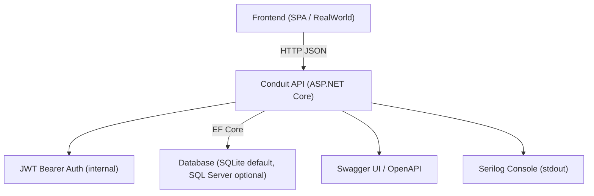
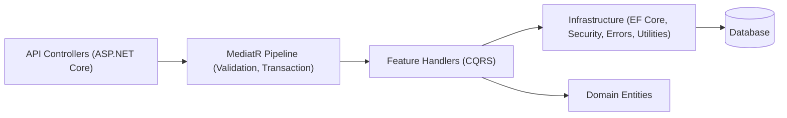
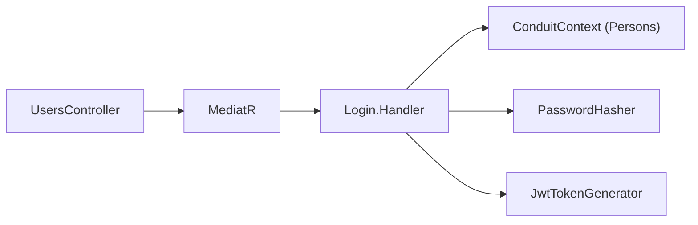
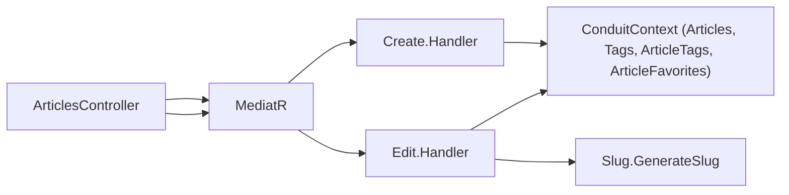
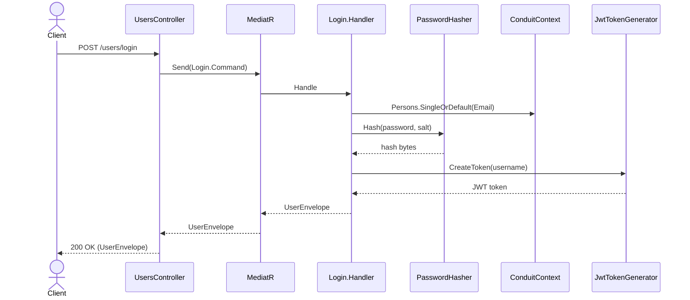
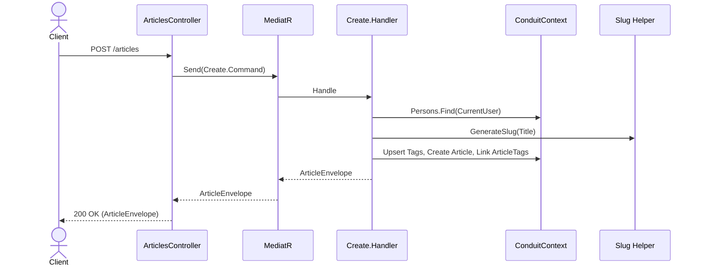
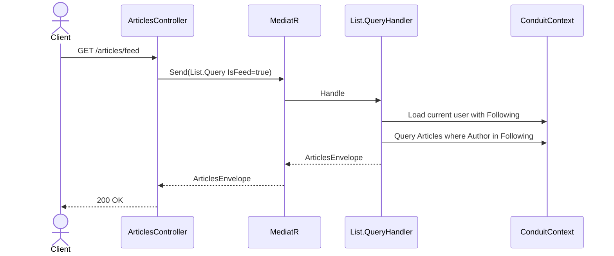
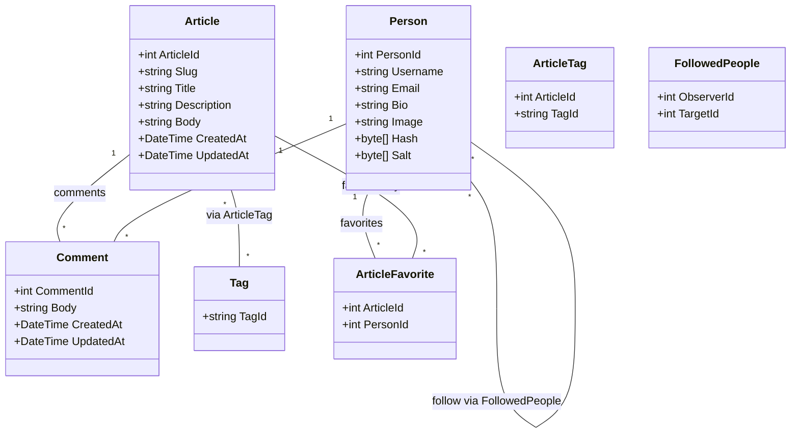
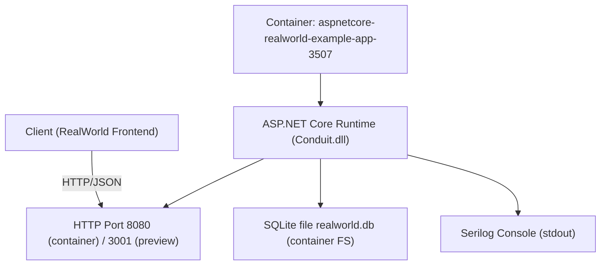
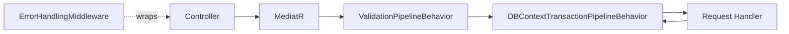

# Architecture Documentation: ASP.NET Core RealWorld Conduit Backend

## 1. Architecture Overview
This service is an ASP.NET Core Web API backend that implements the RealWorld (Conduit) specification. It exposes a REST API for managing users, authentication, profiles, articles, comments, tags, favorites, and following relationships. The system follows a Clean Architecture-inspired, vertically sliced feature organization that uses CQRS with MediatR to separate command/query handling from the HTTP layer, Entity Framework Core for persistence, JWT for authentication, FluentValidation for input validation, AutoMapper for object mapping, Serilog for structured logging, and Swagger for interactive API exploration.

Goals of the design include:
- Provide a clear separation of concerns with thin controllers and feature-oriented “vertical slices.”
- Encapsulate domain logic and data access per feature using CQRS handlers.
- Support transactional request handling and validation as cross-cutting concerns via MediatR pipeline behaviors.
- Offer easy local development with SQLite, and allow alternative providers (e.g., SQL Server).
- Ensure predictable error handling and response envelopes.

Assumptions due to missing or implicit details:
- Assumption: The preview environment exposes the service on TCP port 3001, although the Dockerfile exposes port 8080. Documentation reflects both, and the preview system likely routes external traffic to 3001.
- Assumption: Environment variables for provider/connection string are intended (see docker-compose and launchSettings) but Program.cs currently uses hardcoded defaults; a future change may read from env vars in production.
- Assumption: The single process generates and verifies JWTs using a symmetric key configured in code; there is no external identity provider and no refresh tokens.
- Assumption: Database creation uses EnsureCreated for demo simplicity; no migrations are included in this repo snapshot.

## 2. System Context
The backend is a stateless HTTP service that interacts with:
- External clients: RealWorld frontend (SPA), test tools, API consumers via HTTP/JSON.
- Database: SQLite by default (file-based), SQL Server optionally (via EF Core).
- Logging sink: Serilog Console (stdout).
- API discovery: Swagger UI (OpenAPI via Swashbuckle).

Controllers expose REST endpoints and delegate to MediatR commands/queries that implement the core logic. EF Core persists domain entities such as Person, Article, Comment, Tag, ArticleTag, ArticleFavorite, and FollowedPeople.

Context diagram



Inferred and discovered APIs (examples; based on controllers and features):
- Users: POST /users, POST /users/login, GET /user, PUT /user
- Profiles: GET /profiles/{username}
- Followers: POST /profiles/{username}/follow, DELETE /profiles/{username}/follow
- Articles: GET /articles, GET /articles/feed, GET /articles/{slug}, POST /articles, PUT /articles/{slug}, DELETE /articles/{slug}
- Comments: POST /articles/{slug}/comments, GET /articles/{slug}/comments, DELETE /articles/{slug}/comments/{id}
- Favorites: POST /articles/{slug}/favorite, DELETE /articles/{slug}/favorite
- Tags: GET /tags

External dependencies, frameworks, and libraries:
- ASP.NET Core Web API
- MediatR (CQRS, pipeline behaviors)
- Entity Framework Core (Sqlite, SqlServer, InMemory for tests)
- FluentValidation (validators + MVC action filter)
- AutoMapper (profiles per feature)
- JWT Bearer Authentication (Microsoft.AspNetCore.Authentication.JwtBearer)
- Serilog (console sink)
- Swashbuckle.AspNetCore (Swagger/OpenAPI)

## 3. High-Level Architecture
The architecture is a layered, feature-oriented variant of Clean Architecture with CQRS:
- API Layer: ASP.NET Core controllers receive HTTP requests and send MediatR commands/queries.
- Application Layer (Features): Vertical slices (Users, Articles, Comments, Profiles, Favorites, Followers, Tags) implement request handlers with validation, domain logic, and persistence via ConduitContext.
- Infrastructure Layer: EF Core DbContext and configurations, Security (JWT, password hashing), cross-cutting concerns (validation and transaction pipeline), error handling middleware, current user accessor, and utility helpers (slug).
- Domain Layer: Plain entity classes and relationships; no persistence logic.

Cross-cutting concerns:
- Validation: FluentValidation integrated via MediatR ValidationPipelineBehavior and MVC ValidatorActionFilter (returns 422).
- Transaction management: DBContextTransactionPipelineBehavior wraps each handler in a transaction (skipped for InMemory).
- Error handling: ErrorHandlingMiddleware maps exceptions (RestException and unexpected exceptions) to JSON error responses.
- Security: JWT Bearer authentication with token extraction supporting “Token ” prefix commonly used by RealWorld clients.
- Logging: Serilog Console for structured logs.
- API grouping & Swagger: GroupByApiRootConvention groups operations in Swagger; Swagger configured with bearer security definition.

High-level diagram



## 4. Modules / Components

### Users
Purpose: Registration, login, viewing current user, editing user properties, and token issuance.

Key classes and files:
- Controllers: Features/Users/UsersController.cs (POST /users, POST /users/login), Features/Users/UserController.cs (GET /user, PUT /user)
- Handlers: Create.cs, Login.cs, Edit.cs, Details.cs
- Mapping: MappingProfile.cs (Domain.Person -> User)
- Infrastructure: IPasswordHasher/PasswordHasher, IJwtTokenGenerator/JwtTokenGenerator, ICurrentUserAccessor

Dependencies:
- Incoming: Controllers (HTTP)
- Outgoing: ConduitContext (Persons), PasswordHasher, JwtTokenGenerator, AutoMapper

Example endpoint (illustrative snippet, excerpted/abridged):
```csharp
[HttpPost("login")]
public Task<UserEnvelope> Login([FromBody] Login.Command command, CancellationToken ct)
  => mediator.Send(command, ct);
```

Module diagram



### Articles
Purpose: CRUD for articles, listing feeds, filtering by tag/author/favorited, tag updates, and slug generation.

Key classes and files:
- Controller: Features/Articles/ArticlesController.cs
- Handlers: Create.cs, List.cs, Details.cs, Edit.cs, Delete.cs
- Helpers: ArticleExtensions.cs (GetAllData with includes)
- Envelopes: ArticleEnvelope.cs, ArticlesEnvelope.cs

Dependencies:
- Incoming: Controllers (HTTP)
- Outgoing: ConduitContext (Articles, Tags, ArticleTags, ArticleFavorites), Slug helper

Example endpoint (illustrative):
```csharp
[HttpPost]
[Authorize(AuthenticationSchemes = JwtIssuerOptions.Schemes)]
public Task<ArticleEnvelope> Create([FromBody] Create.Command cmd, CancellationToken ct)
  => mediator.Send(cmd, ct);
```

Module diagram



### Comments
Purpose: Create, list, and delete comments for an article.

Key classes and files:
- Controller: Features/Comments/CommentsController.cs
- Handlers: Create.cs, List.cs, Delete.cs
- Envelopes: CommentEnvelope.cs, CommentsEnvelope.cs

Dependencies:
- Incoming: Controllers (HTTP)
- Outgoing: ConduitContext (Comments, Articles), ICurrentUserAccessor

### Profiles
Purpose: Read-only profile data with “following” flag relative to current user.

Key classes and files:
- Controller: Features/Profiles/ProfilesController.cs
- Reader: ProfileReader.cs (implements IProfileReader)
- Mapping: MappingProfile.cs (Domain.Person -> Profile)
- Envelope: ProfileEnvelope.cs

Dependencies:
- ConduitContext (Persons with Following/Followers)
- ICurrentUserAccessor, AutoMapper

### Favorites
Purpose: Add/remove an article from user favorites, returning the updated article data.

Key classes and files:
- Controller: Features/Favorites/FavoritesController.cs
- Handlers: Add.cs, Delete.cs

Dependencies:
- ConduitContext (Articles, ArticleFavorites, Persons)
- ICurrentUserAccessor

### Followers
Purpose: Follow/unfollow user profiles.

Key classes and files:
- Controller: Features/Followers/FollowersController.cs
- Handlers: Add.cs, Delete.cs (not shown above but implied by controller and feature folder)

Dependencies:
- ConduitContext (FollowedPeople, Persons)
- ICurrentUserAccessor

### Tags
Purpose: List available tags.

Key classes and files:
- Controller: Features/Tags/TagsController.cs
- Handler: List.cs
- Envelope: TagsEnvelope.cs

### Infrastructure and Cross-Cutting
- ConduitContext (EF Core DbContext)
- Validation pipeline (ValidationPipelineBehavior<TRequest,TResponse>)
- Transaction pipeline (DBContextTransactionPipelineBehavior<TRequest,TResponse>)
- Error handling (ErrorHandlingMiddleware, RestException, Constants)
- Security (JwtIssuerOptions, JwtTokenGenerator, PasswordHasher)
- Current user accessor (ICurrentUserAccessor, CurrentUserAccessor)
- MVC ValidatorActionFilter (returns 422 JSON on invalid models)
- Swagger configuration and GroupByApiRootConvention
- Service registration (ServicesExtensions.AddConduit, AddJwt, AddSerilogLogging)

## 5. Data Flow & Core Workflows

### Request Handling Flow
- Controller receives HTTP request, constructs a Command/Query, and sends it via MediatR.
- MediatR pipeline applies validation (FluentValidation) and begins a transaction (if not InMemory).
- Handler executes domain logic with EF Core (ConduitContext) and any infrastructure services (e.g., hashing, JWT).
- On success, pipeline commits transaction and returns an envelope DTO; on failure, transaction is rolled back and ErrorHandlingMiddleware formats an error response.

Sequence example (Login)



Sequence example (Create Article)



Sequence example (List Feed, assumed if authenticated)



Note: Workflows above are directly grounded in the feature handlers and controllers; authentication is enforced via [Authorize] where present.

## 6. Domain Model

Entities and relationships:
- Person: Represents a user, including credentials (Hash/Salt), profile fields, and relationships to favorites and follows.
- Article: Represents a publication authored by a Person with title, description, body, slug, timestamps, tags, favorites, and comments.
- Comment: Represents a comment authored by a Person on an Article.
- Tag: Represents a tag used by Articles, linked via ArticleTag.
- ArticleTag: Join entity for many-to-many Article–Tag.
- ArticleFavorite: Join entity for many-to-many Article–Person favorites.
- FollowedPeople: Join entity for Person–Person follow relationship (ObserverId -> TargetId).

Class diagram



Key invariants and rules (from code):
- FollowedPeople relationships are restricted with DeleteBehavior.Restrict to avoid multiple cascade paths.
- ArticleSlug is generated from Title and updated when Title changes.
- Password hashing uses HMACSHA512 with a static key and unique salt per user.
- Favorited and FavoritesCount are computed from ArticleFavorites (not mapped fields).
- Validators enforce required fields for various commands/queries (e.g., Create User, Login, Create Article).

DTOs and envelopes:
- Many API responses wrap data in envelopes (e.g., UserEnvelope, ArticleEnvelope, ArticlesEnvelope, CommentEnvelope, CommentsEnvelope, ProfileEnvelope, TagsEnvelope).

## 7. Technology Choices & Rationale
- ASP.NET Core Web API: Mature framework for REST services with middleware, DI, and authentication built in.
- MediatR: Implements CQRS pattern to decouple controllers from business logic; supports pipeline behaviors for cross-cutting concerns.
- EF Core (Sqlite/SqlServer): ORM to map domain entities; SQLite is convenient for local/demo usage; SqlServer supported via conditional provider setup.
- FluentValidation: Strong, composable validation separate from controllers/handlers.
- AutoMapper: Simplifies projection from domain entities to DTOs/envelopes.
- JWT Bearer Authentication: Standard stateless authentication mechanism; tokens are generated internally by JwtTokenGenerator.
- Serilog: Structured logging with a console sink ideal for containers.
- Swashbuckle.AspNetCore: Generates OpenAPI/Swagger docs for discoverability.

Patterns used:
- Vertical slice architecture: Features directory encapsulates request models, validators, and handlers together.
- CQRS: Commands and queries represented as IRequest<T> with distinct handlers.
- Middleware for errors; Filters for model validation; Pipeline behaviors for validation and database transactions.

## 8. Quality Attributes
- Scalability: Stateless API scales horizontally; SQLite limits write throughput but SqlServer option supports higher scale.
- Reliability: Transaction pipeline ensures atomicity per request; centralized error handling provides consistent responses.
- Maintainability: Vertical slices keep changes localized; AutoMapper and validators reduce boilerplate.
- Testability: Handlers are MediatR-based and can be tested with in-memory EF Core; integration tests included for key paths.
- Performance: Thin controllers; EF Core includes reduce N+1; sequence of includes in ArticleExtensions provides necessary eager loading.
- Security: JWT authentication with symmetric key; validators prevent invalid input; however, hardcoded signing key and short ValidFor (5 minutes) require attention in production.
- Extensibility: New features can be added as slices; swap DB providers by configuration.

## 9. Deployment View
Runtime environment and hosting:
- Built as a single .NET 8.0 binary (Conduit.dll).
- Dockerfile uses multi-stage build; final image based on mcr.microsoft.com/dotnet/aspnet:8.0 and exposes port 8080.
- Preview system: service reachable on port 3001 (assumption from environment).

Configuration:
- Program.cs currently defaults to sqlite Filename=realworld.db; sqlserver if selected via string variable, but provider/connection values are not read from env vars in this snapshot.
- docker-compose.yml declares environment variables ASPNETCORE_Conduit_DatabaseProvider and ASPNETCORE_Conduit_ConnectionString; launchSettings.json also shows DB_TYPE/DB_CONNECTION_STRING; these differ from Program.cs usage and should be reconciled.

Build and start:
- Docker: `docker-compose up` maps 8080:8080. Preview may map 3001 externally.
- Database: EnsureCreated runs at startup; no migrations are required for this demo.

Deployment diagram



Environment-specific notes:
- Development: SQLite default; Swagger enabled; console logging at verbose level.
- Test: InMemory EF Core used in tests (SliceFixture).
- Production: Recommended to move to a managed DB and secure signing key from secrets or environment variables.

Assumptions:
- Assumption: Reverse proxy or preview environment maps external port 3001 to container port 8080.
- Assumption: A future modification will wire Program.cs to read database provider and connection string from environment variables.

## 10. Gaps, Risks & Improvement Recommendations
Gaps and risks:
- Environment variable mismatch: docker-compose and launchSettings define env vars not consumed by Program.cs. This may cause confusion or misconfiguration.
- Hardcoded JWT signing key and 5-minute token validity: Not production-grade; key should come from secrets and rotation should be supported; refresh tokens or longer validity with revocation should be considered.
- EnsureCreated at startup: No schema migrations; not suitable for production upgrades.
- Authorization surface: Handlers assume current user exists when endpoints are authorized; consider more explicit authorization checks or policies.
- Logging: Console only; no correlation IDs; no structured enrichment beyond default.
- Globalization/localization: Only InternalServerError uses localizer; other messages are constants or plain strings.
- DTO envelopes: Mostly aligned to RealWorld spec, but any spec changes should be versioned.

Recommendations:
- Read DB provider and connection string from environment variables in Program.cs, with sensible defaults and validation.
- Secure JWT: Load symmetric key from secrets, increase token lifetime or add refresh tokens; consider audience/issuer per environment.
- Introduce EF Core migrations and apply pending migrations at startup.
- Enhance logging: add request/response correlation, minimal PII, structured scopes, and log levels per environment.
- Add caching for read-heavy endpoints (e.g., tag list) if required.
- Add OpenAPI schemas for all envelopes and ensure comprehensive examples.
- Add health checks and readiness/liveness probes for container orchestration.
- Extract configuration to strongly-typed options and validate on startup.

## Appendix A: Cross-Cutting Pipeline Diagram



## Appendix B: Example Endpoint Contracts (Illustrative)
These are example request/response shapes inferred from handlers and envelopes. Actual JSON may differ based on serialization options.

Login (POST /users/login)
```json
{
  "user": { "email": "jake@jake.jake", "password": "jakejake" }
}
```
Response (200)
```json
{ "user": { "email": "jake@jake.jake", "username": "jake", "token": "<jwt>", "bio": null, "image": null } }
```

Create Article (POST /articles)
```json
{
  "article": { "title": "How to train your dragon", "description": "Ever wonder how?", "body": "You have to believe", "tagList": ["training","dragons"] }
}
```
Response (200)
```json
{ "article": { "slug": "how-to-train-your-dragon", "title": "How to train your dragon", "description": "Ever wonder how?", "body": "You have to believe", "tagList": ["training","dragons"], "favorited": false, "favoritesCount": 0, "author": { "username": "jake", "bio": null, "image": null } } }
```

Assumptions:
- Assumption: The above payloads are examples to illustrate intent and may not reflect every field.

