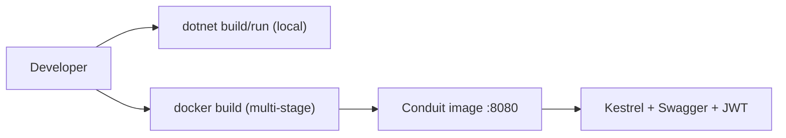

# Code Documentation - Conduit ASP.NET Core RealWorld API

## Overview
This document provides class- and method-level documentation for the entire codebase as it exists. It covers domain entities, infrastructure (DbContext, middleware, security, pipeline behaviors), and all feature slices (Users, Profiles, Followers, Articles, Comments, Favorites, Tags), including controllers, validators, commands/queries, handlers, and DTO/envelope classes.

Assumptions: Method intent and rationale are described only where derivable from code. No signatures, endpoints, or behaviors are invented.

## Composition Root and Service Setup

### Program.cs (top-level statements)
- Purpose: Configure web host, middleware, EF Core DbContext, CORS, Swagger, authentication, and start the app.
- Database provider and connection string are currently hard-coded to "sqlite" and "Filename=realworld.db".
- Registers:
  - Localization resources path "Resources".
  - Swagger generation with JWT security definition.
  - MVC with GroupByApiRootConvention, ValidatorActionFilter, endpoint routing disabled, and null omission in JSON serialization.
  - Conduit services via ServicesExtensions.AddConduit().
  - JWT auth via ServicesExtensions.AddJwt().
  - ErrorHandlingMiddleware, CORS (AllowAnyOrigin/AnyHeader/AnyMethod), UseAuthentication, UseMvc, Swagger and SwaggerUI.
- Ensures database is created (EnsureCreated) at startup.

### Conduit.ServicesExtensions
- public static void AddConduit(IServiceCollection services)
  - Registers MediatR scanning current assembly, ValidationPipelineBehavior, DBContextTransactionPipelineBehavior, FluentValidation validators (from Users.Details), AutoMapper, Security services (IPasswordHasher, IJwtTokenGenerator), ICurrentUserAccessor, IProfileReader, and IHttpContextAccessor.
  - Returns: void
- public static void AddJwt(IServiceCollection services)
  - Configures JwtIssuerOptions (Issuer, Audience, SigningCredentials).
  - Sets TokenValidationParameters with signing key validation, issuer/audience validation, lifetime validation, and zero clock skew.
  - Adds JWT Bearer authentication with a custom OnMessageReceived that also accepts "Authorization: Token <jwt>" format by extracting the token after the "Token " prefix.
  - Returns: void
- public static void AddSerilogLogging(ILoggerFactory loggerFactory)
  - Sets up Serilog logger with console sink and verbose minimum level; attaches to logger factory.
  - Returns: void

## Infrastructure Layer

### Conduit.Infrastructure.ConduitContext : DbContext
- DbSets:
  - Articles, Comments, Persons, Tags, ArticleTags, ArticleFavorites, FollowedPeople.
- OnModelCreating(ModelBuilder modelBuilder)
  - Configures composite keys and relationships:
    - ArticleTag: key (ArticleId, TagId); relationships Article<->ArticleTags, Tag<->ArticleTags.
    - ArticleFavorite: key (ArticleId, PersonId); relationships Article<->ArticleFavorites, Person<->ArticleFavorites.
    - FollowedPeople: key (ObserverId, TargetId); relationships Person.Followers <- Observer (Restrict delete), Person.Following <- Target (Restrict delete).
- Transaction helpers:
  - void BeginTransaction(): Begins transaction with ReadCommitted isolation when not using InMemory provider; no-op if one open.
  - void CommitTransaction(): Commits current transaction; rolls back and rethrows on exception; disposes transaction.
  - void RollbackTransaction(): Rolls back current transaction and disposes it.

### Conduit.Infrastructure.CurrentUserAccessor : ICurrentUserAccessor
- string? GetCurrentUsername()
  - Reads ClaimTypes.NameIdentifier from HttpContext.User.Claims; returns its value or null.

### Conduit.Infrastructure.ICurrentUserAccessor
- Contract: string? GetCurrentUsername()

### Conduit.Infrastructure.Slug
- static string? GenerateSlug(this string? phrase)
  - Returns a URL-friendly slug or null if phrase is null. Transforms to lowercase, strips invalid characters, collapses spaces, trims, truncates to 45 characters, then replaces spaces with hyphens. Uses GeneratedRegex partials.

### Pipeline Behaviors
- Conduit.Infrastructure.ValidationPipelineBehavior<TRequest,TResponse> : IPipelineBehavior<TRequest,TResponse>
  - Task<TResponse> Handle(TRequest request, RequestHandlerDelegate<TResponse> next, CancellationToken cancellationToken)
  - Collects validation failures using registered FluentValidation validators; throws ValidationException on failures; otherwise invokes next handler.
- Conduit.Infrastructure.DBContextTransactionPipelineBehavior<TRequest,TResponse> : IPipelineBehavior<TRequest,TResponse>
  - Task<TResponse> Handle(TRequest request, RequestHandlerDelegate<TResponse> next, CancellationToken cancellationToken)
  - Wraps handler execution with ConduitContext transaction begin/commit; rolls back on exception and rethrows.

### MVC Filters and Conventions
- Conduit.Infrastructure.ValidatorActionFilter : IActionFilter
  - void OnActionExecuting(ActionExecutingContext context): If ModelState is invalid, returns 422 with JSON body { errors: { ... } } and sets ContentType to "application/json".
  - void OnActionExecuted(ActionExecutedContext context): No-op.
- Conduit.Infrastructure.GroupByApiRootConvention : IControllerModelConvention
  - void Apply(ControllerModel controller): Sets ApiExplorer.GroupName based on the first path segment in [Route] template (e.g., "articles" or "profiles").

### Error Handling
- Conduit.Infrastructure.Errors.Constants
  - NOT_FOUND = "not found"; IN_USE = "in use"; InternalServerError = "InternalServerError".
- Conduit.Infrastructure.Errors.RestException : Exception
  - Properties: object? Errors, HttpStatusCode Code. Used to signal HTTP errors from handlers.
- Conduit.Infrastructure.Errors.ErrorHandlingMiddleware
  - Task Invoke(HttpContext context): Invokes next; catches exceptions and calls HandleExceptionAsync.
  - private static Task HandleExceptionAsync(HttpContext context, Exception exception, ILogger<ErrorHandlingMiddleware> logger, IStringLocalizer<ErrorHandlingMiddleware> localizer): Maps RestException to status code and serializes its errors; otherwise logs and returns 500 with localized InternalServerError message.

### Security
- Conduit.Infrastructure.Security.IJwtTokenGenerator
  - string CreateToken(string username)
- Conduit.Infrastructure.Security.JwtIssuerOptions
  - Properties: Issuer, Subject, Audience, NotBefore (UtcNow), IssuedAt (UtcNow), ValidFor (default 5 minutes), Expiration (IssuedAt + ValidFor), JtiGenerator (GUID), SigningCredentials.
- Conduit.Infrastructure.Security.JwtTokenGenerator : IJwtTokenGenerator
  - string CreateToken(string username): Creates JWT with sub, jti, and iat claims, signed using configured options.
- Conduit.Infrastructure.Security.IPasswordHasher : IDisposable
  - Task<byte[]> Hash(string password, byte[] salt)
- Conduit.Infrastructure.Security.PasswordHasher : IPasswordHasher
  - Task<byte[]> Hash(string password, byte[] salt): Computes HMACSHA512 hash of password+salt using a static key "realworld". Disposes underlying HMACSHA512 in Dispose().

## Domain Layer

### Conduit.Domain.Person
- Properties: PersonId (ignored in JSON), Username, Email, Bio, Image, ArticleFavorites (ignored), Following (ignored), Followers (ignored), Hash (ignored), Salt (ignored).

### Conduit.Domain.Article
- Properties: ArticleId (ignored in JSON), Slug, Title, Description, Body, Author, Comments.
- Computed [NotMapped]: Favorited (ArticleFavorites.Count != 0), FavoritesCount (ArticleFavorites.Count), TagList (derived from ArticleTags).
- Navigation (ignored in JSON): ArticleTags, ArticleFavorites.
- Timestamps: CreatedAt, UpdatedAt.

### Conduit.Domain.Comment
- Properties: CommentId (serialized as "id"), Body, Author, AuthorId (ignored), Article (ignored), ArticleId (ignored), CreatedAt, UpdatedAt.

### Conduit.Domain.Tag
- Properties: TagId; navigation ArticleTags.

### Conduit.Domain.ArticleTag
- Properties: ArticleId, Article, TagId, Tag.

### Conduit.Domain.ArticleFavorite
- Properties: ArticleId, Article, PersonId, Person.

### Conduit.Domain.FollowedPeople
- Properties: ObserverId, Observer, TargetId, Target.

## Feature Slices

### Articles Feature (Conduit.Features.Articles)

#### ArticlesController : Controller
- [HttpGet] Task<ArticlesEnvelope> Get(tag, author, favorited, limit, offset, CancellationToken)
  - Returns filtered/paginated list using List.Query.
- [HttpGet("feed")] Task<ArticlesEnvelope> GetFeed(tag, author, favorited, limit, offset, CancellationToken)
  - Same query with IsFeed=true; relies on current user to filter by followed authors.
- [HttpGet("{slug}")] Task<ArticleEnvelope> Get(string slug, CancellationToken)
  - Returns article details by slug.
- [HttpPost] [Authorize] Task<ArticleEnvelope> Create([FromBody] Create.Command, CancellationToken)
  - Creates a new article.
- [HttpPut("{slug}")] [Authorize] Task<ArticleEnvelope> Edit(string slug, [FromBody] Edit.Model, CancellationToken)
  - Updates article fields and tags.
- [HttpDelete("{slug}")] [Authorize] Task Delete(string slug, CancellationToken)
  - Deletes article by slug.

#### ArticleExtensions
- static IQueryable<Article> GetAllData(this DbSet<Article> articles)
  - Eager loads Author, ArticleFavorites, ArticleTags; AsNoTracking().

#### Create
- ArticleData { string? Title, Description, Body; string[]? TagList }
- ArticleDataValidator: Title/Description/Body are required (NotNull/NotEmpty).
- record Command(ArticleData Article) : IRequest<ArticleEnvelope>
- CommandValidator: validates Article via ArticleDataValidator.
- Handler(ConduitContext, ICurrentUserAccessor) : IRequestHandler<Command, ArticleEnvelope>
  - Task<ArticleEnvelope> Handle(Command, CancellationToken)
  - Loads current author; upserts tags; creates Article with slug generated by Slug.GenerateSlug; saves Article and ArticleTags; returns ArticleEnvelope.

#### Edit
- record ArticleData(string? Title, string? Description, string? Body, string[]? TagList)
- record Model(ArticleData Article)
- record Command(Model Model, string Slug) : IRequest<ArticleEnvelope>
- CommandValidator: Model.Article must not be null.
- Handler(ConduitContext) : IRequestHandler<Command, ArticleEnvelope>
  - Task<ArticleEnvelope> Handle(Command, CancellationToken)
  - Loads article with ArticleTags; updates fields and slug; computes tags to create/delete via private helpers; updates UpdatedAt if needed; persists and reloads article using GetAllData; returns ArticleEnvelope.
  - Private helpers:
    - List<ArticleTag> GetArticleTagsToCreate(Article article, IEnumerable<string> tagList)
    - List<ArticleTag> GetArticleTagsToDelete(Article article, IEnumerable<string> tagList)

#### Delete
- record Command(string Slug) : IRequest
- CommandValidator: Slug required.
- QueryHandler(ConduitContext) : IRequestHandler<Command>
  - Task Handle(Command, CancellationToken)
  - Loads article by slug; throws 404 (RestException) if missing; removes and saves.

#### Details
- record Query(string Slug) : IRequest<ArticleEnvelope>
- QueryValidator: Slug required.
- QueryHandler(ConduitContext) : IRequestHandler<Query, ArticleEnvelope>
  - Task<ArticleEnvelope> Handle(Query, CancellationToken)
  - Loads article via GetAllData; returns envelope or throws 404.

#### List
- record Query(string Tag, string Author, string FavoritedUsername, int? Limit, int? Offset, bool IsFeed=false) : IRequest<ArticlesEnvelope>
- QueryHandler(ConduitContext, ICurrentUserAccessor) : IRequestHandler<Query, ArticlesEnvelope>
  - Task<ArticlesEnvelope> Handle(Query, CancellationToken)
  - Builds base query via GetAllData; if feed and current user available, filters by followed authors; supports tag, author, favorited filters; applies Skip/Take; AsNoTracking; returns ArticlesEnvelope with total count.

#### DTOs
- record ArticleEnvelope(Article Article)
- class ArticlesEnvelope { List<Article> Articles; int ArticlesCount }

### Comments Feature (Conduit.Features.Comments)

#### CommentsController : Controller
- [HttpPost("{slug}/comments")] [Authorize] Task<CommentEnvelope> Create(slug, [FromBody] Create.Model, CancellationToken)
- [HttpGet("{slug}/comments")] Task<CommentsEnvelope> Get(slug, CancellationToken)
- [HttpDelete("{slug}/comments/{id}")] [Authorize] Task Delete(slug, id, CancellationToken)

#### Create
- record CommentData(string? Body)
- record Model(CommentData Comment) : IRequest<CommentEnvelope>
- record Command(Model Model, string Slug) : IRequest<CommentEnvelope>
- CommandValidator: Body must not be empty.
- Handler(ConduitContext, ICurrentUserAccessor) : IRequestHandler<Command, CommentEnvelope>
  - Creates comment by current user on article; returns envelope; 404 if article not found.

#### Delete
- record Command(string Slug, int Id) : IRequest
- CommandValidator: Slug required.
- QueryHandler(ConduitContext) : IRequestHandler<Command>
  - Deletes comment by id on a slugged article; throws 404 if article or comment not found.

#### List
- record Query(string Slug) : IRequest<CommentsEnvelope>
- QueryHandler(ConduitContext) : IRequestHandler<Query, CommentsEnvelope>
  - Returns CommentsEnvelope for article with author included; 404 if article not found.

#### DTOs
- record CommentEnvelope(Comment Comment)
- record CommentsEnvelope(List<Comment> Comments)

### Favorites Feature (Conduit.Features.Favorites)

#### FavoritesController : Controller
- [HttpPost("{slug}/favorite")] [Authorize] Task<ArticleEnvelope> FavoriteAdd(slug, CancellationToken)
- [HttpDelete("{slug}/favorite")] [Authorize] Task<ArticleEnvelope> FavoriteDelete(slug, CancellationToken)

#### Add
- record Command(string Slug) : IRequest<ArticleEnvelope>
- CommandValidator: Slug required.
- QueryHandler(ConduitContext, ICurrentUserAccessor) : IRequestHandler<Command, ArticleEnvelope>
  - Adds ArticleFavorite for current user and returns updated ArticleEnvelope; 404 if article or user not found.

#### Delete
- record Command(string Slug) : IRequest<ArticleEnvelope>
- CommandValidator: Slug required.
- QueryHandler(ConduitContext, ICurrentUserAccessor) : IRequestHandler<Command, ArticleEnvelope>
  - Removes ArticleFavorite for current user if present; returns updated ArticleEnvelope; 404 if article or user not found.

### Followers Feature (Conduit.Features.Followers)

#### FollowersController : Controller
- [HttpPost("{username}/follow")] [Authorize] Task<ProfileEnvelope> Follow(username, CancellationToken)
- [HttpDelete("{username}/follow")] [Authorize] Task<ProfileEnvelope> Unfollow(username, CancellationToken)

#### Add
- record Command(string Username) : IRequest<ProfileEnvelope>
- CommandValidator: Username required.
- QueryHandler(ConduitContext, ICurrentUserAccessor, IProfileReader) : IRequestHandler<Command, ProfileEnvelope>
  - Creates FollowedPeople relationship; returns profile via IProfileReader; 404 if target or observer not found.

#### Delete
- record Command(string Username) : IRequest<ProfileEnvelope>
- CommandValidator: Username required.
- QueryHandler(ConduitContext, ICurrentUserAccessor, IProfileReader) : IRequestHandler<Command, ProfileEnvelope>
  - Removes FollowedPeople if exists; returns profile; 404 if target or observer not found.

### Profiles Feature (Conduit.Features.Profiles)

#### ProfilesController : Controller
- [HttpGet("{username}")] Task<ProfileEnvelope> Get(username, CancellationToken)
  - Delegates to Details.Query.

#### Details
- record Query(string Username) : IRequest<ProfileEnvelope>
- QueryValidator: Username required.
- QueryHandler(IProfileReader) : IRequestHandler<Query, ProfileEnvelope>
  - Returns profile from IProfileReader.

#### IProfileReader
- Task<ProfileEnvelope> ReadProfile(string username, CancellationToken)
  - Contract for profile retrieval with follow status.

#### ProfileReader : IProfileReader
- ReadProfile(username, token)
  - Loads person by username; maps to Profile; if current user exists, loads current with Following & Followers; sets Profile.IsFollowed based on whether currentPerson.Followers contains target (as implemented); returns ProfileEnvelope; 404 if user not found.

#### MappingProfile : AutoMapper.Profile
- Constructor: CreateMap<Domain.Person, Profile>(MemberList.None)

#### DTOs
- class Profile { Username, Bio, Image, bool IsFollowed (serialized as "following") }
- record ProfileEnvelope(Profile Profile)

### Tags Feature (Conduit.Features.Tags)

#### TagsController : Controller
- [HttpGet] Task<TagsEnvelope> Get(CancellationToken)
  - Delegates to List.Query.

#### List
- record Query : IRequest<TagsEnvelope>
- QueryHandler(ConduitContext) : IRequestHandler<Query, TagsEnvelope>
  - Returns ordered list of tag ids in TagsEnvelope.

#### DTOs
- class TagsEnvelope { List<string> Tags }

### Users Feature (Conduit.Features.Users)

#### UsersController
- [HttpPost] Task<UserEnvelope> Create([FromBody] Create.Command, CancellationToken)
- [HttpPost("login")] Task<UserEnvelope> Login([FromBody] Login.Command, CancellationToken)

#### UserController (Authorized)
- [HttpGet] Task<UserEnvelope> GetCurrent(CancellationToken): Uses Details.Query with username from ICurrentUserAccessor.
- [HttpPut] Task<UserEnvelope> UpdateUser([FromBody] Edit.Command, CancellationToken)

#### Create
- record UserData(string? Username, string? Email, string? Password)
- record Command(UserData User) : IRequest<UserEnvelope>
- CommandValidator: Username/Email/Password required.
- Handler(ConduitContext, IPasswordHasher, IJwtTokenGenerator, IMapper) : IRequestHandler<Command, UserEnvelope>
  - Validates username/email uniqueness; creates Person with salted password hash; saves; maps to User; sets Token via IJwtTokenGenerator; returns UserEnvelope.

#### Login
- class UserData { string? Email, string? Password }
- record Command(UserData User) : IRequest<UserEnvelope>
- CommandValidator: User, Email, Password required.
- Handler(ConduitContext, IPasswordHasher, IJwtTokenGenerator, IMapper) : IRequestHandler<Command, UserEnvelope>
  - Loads Person by email; verifies password by hashing with saved salt; returns mapped User with Token; throws unauthorized on failure.

#### Details
- record Query(string Username) : IRequest<UserEnvelope>
- QueryValidator: Username required.
- QueryHandler(ConduitContext, IJwtTokenGenerator, IMapper) : IRequestHandler<Query, UserEnvelope>
  - Loads Person by username (AsNoTracking); maps to User; sets Token; throws 404 if missing.

#### Edit
- class UserData { Username, Email, Password, Bio, Image (all optional) }
- record Command(UserData User) : IRequest<UserEnvelope>
- CommandValidator: User not null.
- Handler(ConduitContext, IPasswordHasher, ICurrentUserAccessor, IMapper) : IRequestHandler<Command, UserEnvelope>
  - Loads current Person; updates fields provided; if Password provided, generates new salt and hash; saves; returns updated User.

#### MappingProfile : Profile
- CreateMap<Domain.Person, User>(MemberList.None)

#### DTOs
- class User { Username, Email, Bio, Image, Token }
- record UserEnvelope(User User)

## API Contract Summary (from Controllers)
- Users:
  - POST /users
  - POST /users/login
- Current User:
  - GET /user (auth)
  - PUT /user (auth)
- Profiles:
  - GET /profiles/{username}
- Followers:
  - POST /profiles/{username}/follow (auth)
  - DELETE /profiles/{username}/follow (auth)
- Articles:
  - GET /articles?tag&author&favorited&limit&offset
  - GET /articles/feed?tag&author&favorited&limit&offset
  - GET /articles/{slug}
  - POST /articles (auth)
  - PUT /articles/{slug} (auth)
  - DELETE /articles/{slug} (auth)
- Comments:
  - POST /articles/{slug}/comments (auth)
  - GET /articles/{slug}/comments
  - DELETE /articles/{slug}/comments/{id} (auth)
- Favorites:
  - POST /articles/{slug}/favorite (auth)
  - DELETE /articles/{slug}/favorite (auth)
- Tags:
  - GET /tags

## Notable Implementation Notes
- Validation is handled in two places: FluentValidation pipeline for handler input models and ValidatorActionFilter for MVC model state (422 results).
- Error handling uses middleware capturing exceptions and serializing consistent error responses. RestException communicates HTTP status and error payloads from handlers.
- Transaction handling is centralized via pipeline behavior and disabled for InMemory provider (tests).
- Authentication uses JwtBearer with a hard-coded signing key and accepts Authorization header values starting with "Token " for compatibility.

## Example Snippets (illustrative)
These are excerpts of actual behavior; no code is changed.

```csharp
// Accept non-standard "Token " Authorization headers
options.Events = new JwtBearerEvents
{
    OnMessageReceived = (context) =>
    {
        var token = context.HttpContext.Request.Headers.Authorization.ToString();
        if (token.StartsWith("Token ", StringComparison.OrdinalIgnoreCase))
        {
            context.Token = token["Token ".Length..].Trim();
        }
        return Task.CompletedTask;
    },
};
```

```csharp
// Validation pipeline behavior
public async Task<TResponse> Handle(TRequest request, RequestHandlerDelegate<TResponse> next, CancellationToken cancellationToken)
{
    var context = new ValidationContext<TRequest>(request);
    var failures = _validators.Select(v => v.Validate(context))
                              .SelectMany(result => result.Errors)
                              .Where(f => f != null)
                              .ToList();

    if (failures.Count != 0)
    {
        throw new ValidationException(failures);
    }

    return await next();
}
```

## Tests and Testability
Integration tests under tests/Conduit.IntegrationTests use:
- EF Core InMemory database configured in SliceFixture.
- ServiceCollection with AddConduit() to wire MediatR and validators.
- Helpers to create default users and articles for scenarios.
These tests validate Users (create, login) and Articles (create, edit, delete) and demonstrate real handler execution.

```csharp
// SliceFixture: create in-memory context and service provider
var builder = new DbContextOptionsBuilder();
builder.UseInMemoryDatabase(_dbName);
services.AddSingleton(new ConduitContext(builder.Options));
```

```csharp
// Users: Create test
var command = new Create.Command(new Create.UserData("username", "email", "password"));
await SendAsync(command);
var created = await ExecuteDbContextAsync(db =>
    db.Persons.Where(d => d.Email == command.User.Email).SingleOrDefaultAsync());
Assert.NotNull(created);
```

```csharp
// Articles: Create test via helper
var command = new Create.Command(new Create.ArticleData
{
    Title = "Test article",
    Description = "desc",
    Body = "body",
    TagList = new[] { "tag1", "tag2" }
});
var article = await ArticleHelpers.CreateArticle(this, command);
Assert.NotNull(article);
```

## Configuration and Build Artifacts
- Directory.Build.props enforces net8.0, nullable enabled, warnings-as-errors, centralized package versioning, and package lock files.
- Directory.Packages.props lists all package versions (AutoMapper, MediatR, FluentValidation, EF Core, Serilog, Swashbuckle, etc.).
- Dockerfile exposes 8080 and uses a build step targeting a non-present build/build.csproj.
- docker-compose publishes 8080 and injects environment variables; Program.cs does not read them currently.



This documentation reflects the repository’s current state without inventing APIs or modules. Any suggested improvements are included for consideration only.
