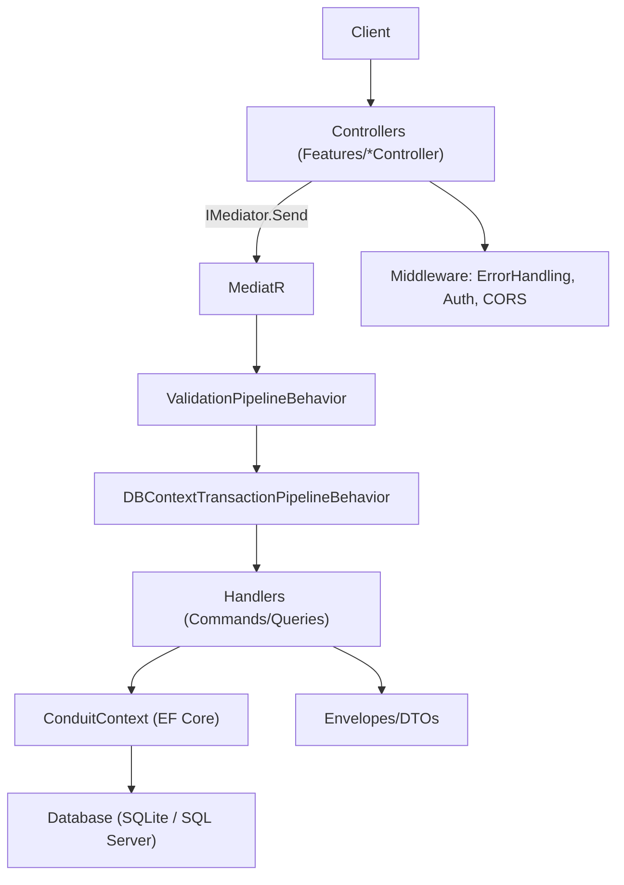
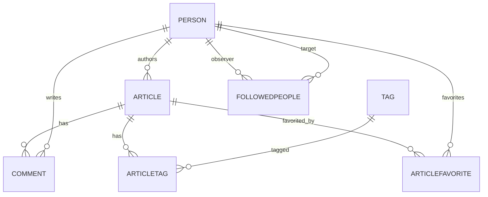
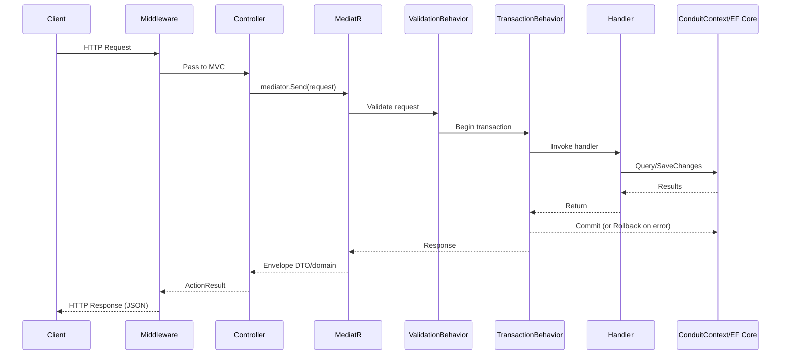
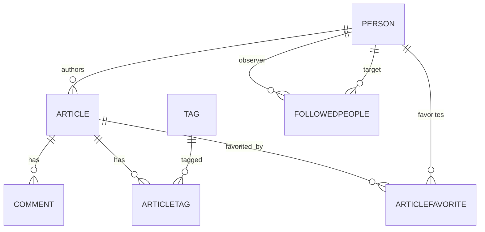
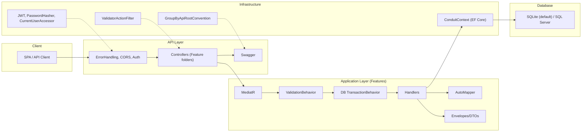

# RealWorld ASP.NET Core (Conduit) Architecture Document

## 1) System Overview
The RealWorld API specification describes a medium.com–style publishing platform with a standard, language-agnostic REST API. This ASP.NET Core (Conduit) implementation provides a backend for creating and managing articles, comments, tags, and user profiles with JWT-based authentication and a follow/favorite system.

Major capabilities implemented:
- Articles: Create, list, retrieve, edit, delete; feed with filtering by tag, author, or favorited user
- Comments: Create, list, delete for a given article
- Tags: List all tags
- Favorites: Add/remove favorites for an article
- Profiles: Retrieve profiles and follow/unfollow users
- Users: Registration, login, get current user, and update current user
- Authentication: JWT Bearer with support for the RealWorld “Token <jwt>” header format

This implementation follows a vertical slice, feature-oriented structure using CQRS with MediatR and Entity Framework Core (EF Core).

## 2) Architectural Goals & Principles
The design is pragmatic and aligns with Clean Architecture inspirations and vertical slice architecture:

- Separation of concerns via layers and feature folders
- Thin controllers delegating to MediatR requests/handlers
- CQRS-style Commands/Queries with validators per request
- Testability through MediatR decoupling and EF Core abstractions
- Maintainability via feature folders and envelopes/DTOs
- Simplicity and readability by minimizing framework ceremony
- RealWorld spec compliance (endpoints, envelopes, JWT conventions)

Key technologies:
- ASP.NET Core Web API
- MediatR for request dispatching and pipeline behaviors
- EF Core for data access
- FluentValidation for request validation
- AutoMapper for mapping domain entities to API DTOs
- Serilog for structured logging
- Swagger (Swashbuckle) for API documentation
- JWT for authentication

## 3) High‑Level Architecture
Layers and responsibilities:
- API Layer (Controllers/Middleware)
- Application Layer (Features/*: Commands, Queries, Handlers, Validators, Envelopes, Mapping)
- Domain Layer (Entity models and computed fields)
- Infrastructure Layer (DbContext, Security, Pipeline behaviors, Filters, Conventions, Errors)
- Database (SQLite by default; optional SQL Server)

Flow:
- Controllers invoke IMediator.Send with Command/Query objects
- MediatR executes pipeline behaviors: validation, then transaction scope
- Handlers perform business logic using ConduitContext (EF Core)
- Results are returned using envelope DTOs (e.g., ArticleEnvelope, UserEnvelope)
- Middleware handles errors and formatting; JWT middleware authenticates requests

Text-based diagram:


Integration points:
- Validation: FluentValidation via ValidationPipelineBehavior
- Authentication: JWT bearer with custom token extraction (“Token ” prefix)
- Errors: ErrorHandlingMiddleware wraps exceptions and returns JSON errors
- Swagger: Grouping by route root using GroupByApiRootConvention

## 4) Module / Feature Architecture
The application uses feature folders under src/Conduit/Features. Each feature typically includes controllers, commands/queries, handlers, validators, envelopes/DTOs, and sometimes mapping profiles.

### Users
- Purpose: User registration, login, get/update current user
- Key classes:
  - Controllers: UsersController (registration, login), UserController (get/update current user; [Authorize])
  - Commands/Queries: Create.Command, Login.Command, Edit.Command, Details.Query
  - Handlers: Implement MediatR IRequestHandler for each
  - DTOs/Envelopes: User, UserEnvelope
  - Validators: Command validators per command/query
  - Mapping: Features/Users/MappingProfile (Domain.Person → Users.User)
- Request flow:
  - Controller action receives [FromBody] model → mediator.Send(Command/Query)
  - ValidationPipelineBehavior validates → DBContextTransactionPipelineBehavior wraps a transaction
  - Handler uses ConduitContext and security services (PasswordHasher, JwtTokenGenerator)
  - Returns UserEnvelope with Token populated for auth operations

### Articles
- Purpose: CRUD articles and list with filtering; provide article feed
- Key classes:
  - Controller: ArticlesController ([Authorize] for create/edit/delete)
  - Commands/Queries: Create.Command, Edit.Command, Delete.Command, Details.Query, List.Query
  - Handlers: CRUD and list logic via EF Core; ArticleExtensions.GetAllData loads navigation data
  - Envelopes: ArticleEnvelope, ArticlesEnvelope
  - Validators: Command/query validators
- Request flow:
  - Controller → mediator.Send
  - Handler loads author, tags, favorites, etc. using ConduitContext
  - Create/Edit manage tags and slug generation (Slug.GenerateSlug)
  - Envelope returns Domain.Article (with computed fields like TagList, FavoritesCount)

### Comments
- Purpose: Create/list/delete comments for an article
- Key classes:
  - Controller: CommentsController ([Authorize] for create/delete)
  - Commands/Queries: Create.Command, List.Query, Delete.Command
  - Envelopes: CommentEnvelope, CommentsEnvelope
  - Validators: Command/query validators
- Request flow:
  - Controller → mediator.Send
  - Handler loads article and author, persists comment
  - Responses wrap Domain.Comment

### Tags
- Purpose: List tags
- Key classes:
  - Controller: TagsController
  - Query: List.Query
  - Envelope: TagsEnvelope
- Request flow:
  - Controller → mediator.Send
  - Query returns sorted tags from ConduitContext.Tags

### Favorites
- Purpose: Add/remove article favorites
- Key classes:
  - Controller: FavoritesController ([Authorize])
  - Commands: Add.Command, Delete.Command
  - Envelope: ArticleEnvelope
- Request flow:
  - Controller → mediator.Send
  - Handler ensures article/person exist, upserts/deletes ArticleFavorite
  - Returns ArticleEnvelope with refreshed article aggregate (via ArticleExtensions.GetAllData)

### Followers (Follow System)
- Purpose: Follow/unfollow users
- Key classes:
  - Controller: FollowersController ([Authorize])
  - Commands: Add.Command, Delete.Command
  - Envelope: Profiles.ProfileEnvelope
- Request flow:
  - Controller → mediator.Send
  - Handler upserts/deletes FollowedPeople join entries
  - Delegates profile composition to Profiles.ProfileReader

### Profiles
- Purpose: Get user profile, including “following” status
- Key classes:
  - Controller: ProfilesController
  - Query: Details.Query
  - Reader: IProfileReader, ProfileReader
  - DTO/Envelope: Profile, ProfileEnvelope
  - Mapping: Features/Profiles/MappingProfile (Domain.Person → Profiles.Profile)
- Request flow:
  - Controller → mediator.Send(Details.Query)
  - Handler uses ProfileReader to load profile and compute “following” relative to current user

## 5) Domain Model Documentation
Entities (src/Conduit/Domain):
- Article: Slug, Title, Description, Body, Author (Person), Comments; computed Favorited (true if any favorites exist), FavoritesCount, TagList; timestamps CreatedAt, UpdatedAt
- Comment: CommentId, Body, Author, Article, CreatedAt, UpdatedAt
- Person: Username, Email, Bio, Image, Hash, Salt; navigation: ArticleFavorites, Followers, Following
- Tag: TagId; navigation: ArticleTags
- ArticleTag: Composite key (ArticleId, TagId); many-to-many join
- ArticleFavorite: Composite key (ArticleId, PersonId); many-to-many join
- FollowedPeople: Composite key (ObserverId, TargetId); self-referencing many-to-many on Person

Relationships and aggregates:
- Aggregate roots center on Article and Person in most workflows
- Article → Comments: 1-to-many
- Person → Article (Author): 1-to-many
- Article ↔ Tag: many-to-many via ArticleTag
- Article ↔ Person (Favorites): many-to-many via ArticleFavorite
- Person ↔ Person (Follow): many-to-many via FollowedPeople with restricted deletes

Text-based ERD:


Notes on computed fields (Article):
- Favorited: true if there exists at least one ArticleFavorite for the article
- FavoritesCount: count of ArticleFavorites
- TagList: derived from ArticleTags

## 6) Application Layer
MediatR organizes business logic into commands and queries with handlers and validators.

- Commands/Queries: Records or classes representing operations (e.g., Create.Command, Edit.Command, Details.Query)
- Handlers: Implement IRequestHandler<TRequest, TResponse>, injected with ConduitContext and other services
- Validation: FluentValidation validators registered by assembly scan; enforced by ValidationPipelineBehavior
- Transactions: DBContextTransactionPipelineBehavior begins/commits/rolls back transactions per request (skipped for InMemory databases)
- Request/Response: Handlers return envelope DTOs wrapping domain entities or lists
- Mapping: AutoMapper profiles map Domain.Person to Users.User and to Profiles.Profile

Example handler outline:
```csharp
public class Handler(ConduitContext context, ICurrentUserAccessor current, IMapper mapper)
  : IRequestHandler<Create.Command, UserEnvelope>
{
  public async Task<UserEnvelope> Handle(Create.Command message, CancellationToken ct)
  {
    // Validate uniqueness, hash password, persist
    // Map Person -> User and emit token
  }
}
```

## 7) Infrastructure Layer
Core components under src/Conduit/Infrastructure:

- ConduitContext (DbContext)
  - DbSets: Articles, Comments, Persons, Tags, ArticleTags, ArticleFavorites, FollowedPeople
  - OnModelCreating:
    - ArticleTag: key = { ArticleId, TagId }; FK Article, Tag
    - ArticleFavorite: key = { ArticleId, PersonId }; FK Article, Person
    - FollowedPeople: key = { ObserverId, TargetId }
      - Observer → Followers OnDelete(DeleteBehavior.Restrict)
      - Target → Following OnDelete(DeleteBehavior.Restrict)
  - Transaction helpers:
    - BeginTransaction(): starts transaction (skips for InMemory provider)
    - CommitTransaction(), RollbackTransaction()

- Pipeline behaviors:
  - ValidationPipelineBehavior<TReq,TRes>: executes FluentValidation validators; throws on failure
  - DBContextTransactionPipelineBehavior<TReq,TRes>: wraps handler execution in a transaction

- Security:
  - PasswordHasher (HMACSHA512 with a fixed key “realworld”; salt concatenated per user)
  - JwtIssuerOptions: issuer, audience, validity (default 5 minutes), signing credentials, JTI generator
  - JwtTokenGenerator: sub, jti, iat claims; uses configured issuer/audience/signing key
  - ICurrentUserAccessor/CurrentUserAccessor: reads ClaimTypes.NameIdentifier from HttpContext (mapped from JWT “sub”)

- Web infrastructure:
  - ErrorHandlingMiddleware: converts exceptions to JSON; RestException yields specific code/errors; otherwise 500 with InternalServerError
  - ValidatorActionFilter: returns 422 with aggregated model state errors for invalid MVC model binding
  - GroupByApiRootConvention: sets Swagger group name from the first route segment (e.g., “articles”, “users”)
  - Slug: GenerateSlug extension method for article titles

- Logging:
  - Serilog configured via ILoggerFactory extension; console sink with structured output

## 8) API Layer
Entry points and policies defined in Program.cs and controllers under Features.

- Controllers and routing:
  - Attribute routing ([Route("...")]) with traditional MVC (EnableEndpointRouting=false; UseMvc())
  - Controllers live in feature folders (e.g., Features/Articles/ArticlesController.cs)
  - Most controllers inherit from Controller; some are discovered via attributes without inheritance

- Middleware:
  - ErrorHandlingMiddleware first to catch/format exceptions
  - CORS: AllowAnyOrigin/AnyHeader/AnyMethod
  - Authentication: app.UseAuthentication()
  - MVC pipeline: app.UseMvc()

- Filters:
  - ValidatorActionFilter produces 422 for invalid ModelState

- Swagger:
  - Bearer security definition
  - Tag grouping via GroupByApiRootConvention
  - Custom schema IDs to avoid conflicts (type.FullName with '+' replaced)

- Model binding:
  - [FromBody] for commands/models; System.Text.Json WriteIgnoreNull enabled

- Authorization:
  - [Authorize(AuthenticationSchemes = JwtIssuerOptions.Schemes)] on endpoints requiring authentication
  - Supports “Authorization: Token <jwt>” header via JwtBearerEvents.OnMessageReceived

- CORS:
  - Broad policy for integration and demo convenience

## 9) Request Lifecycle
Step-by-step flow from HTTP request to response:

1. Client sends HTTP request to route (e.g., POST /api/users or POST /users in this configuration)
2. ErrorHandlingMiddleware wraps request; CORS headers applied; JWT middleware authenticates
3. MVC dispatches to controller action; ValidatorActionFilter ensures ModelState validity
4. Controller calls mediator.Send(Command/Query)
5. ValidationPipelineBehavior executes FluentValidation validators
6. DBContextTransactionPipelineBehavior begins transaction (if not InMemory)
7. Handler runs business logic against ConduitContext; may call security services or mappers
8. Transaction committed or rolled back based on success or exception
9. Response envelope returned as JSON; ErrorHandlingMiddleware formats errors if thrown

Dataflow diagram:


## 10) Database Architecture
EF Core builds the following tables/entities:
- Persons (Person)
- Articles (Article)
- Comments (Comment)
- Tags (Tag)
- ArticleTags (ArticleTag) — composite key (ArticleId, TagId)
- ArticleFavorites (ArticleFavorite) — composite key (ArticleId, PersonId)
- FollowedPeople — composite key (ObserverId, TargetId) with DeleteBehavior.Restrict relationships

SQLite is the default provider with connection string “Filename=realworld.db”. SQL Server is optionally supported (as indicated in Program.cs) but marked to work in a Windows container scenario.

Schema diagram:


## 11) Cross‑Cutting Concerns
- Error handling: ErrorHandlingMiddleware translates RestException and unhandled exceptions into JSON responses and logs unhandled errors
- Logging: Serilog console sink with structured output; integrated via ILoggerFactory extension
- Security: JWT bearer authentication; header token prefix “Token ” supported; Current user via ICurrentUserAccessor
- Validation: FluentValidation integrated via pipeline behavior; MVC ValidatorActionFilter for ModelState errors
- Transactions: DBContextTransactionPipelineBehavior wraps handler execution in a transaction (except InMemory provider)

## 12) Security Architecture
- JWT authentication flow:
  - Login/Create handlers issue JWT using JwtTokenGenerator with issuer, audience, signing credentials from JwtIssuerOptions
  - Claims include sub (username), jti, iat
  - Token lifetime from JwtIssuerOptions.ValidFor (default 5 minutes)
  - JwtBearer middleware validates signature, issuer, audience, expiry (ClockSkew = 0)

- Token usage:
  - Authorization header supports “Bearer <jwt>” and “Token <jwt>”; a JwtBearerEvents hook normalizes tokens starting with “Token ”
  - Claims mapping ensures sub → ClaimTypes.NameIdentifier, enabling CurrentUserAccessor to read the current username

- Password hashing:
  - HMACSHA512 with a fixed key (“realworld”); salt (per-user byte[]) appended to password before hashing
  - Hash and Salt stored on Person

- Authorization:
  - [Authorize(AuthenticationSchemes = JwtIssuerOptions.Schemes)] guards protected endpoints (e.g., creating articles, posting comments, following)

## 13) Deployment Architecture
- App startup (Program.cs):
  - Configure DbContext with provider (SQLite default; optional SQL Server branch)
  - AddLocalization
  - AddSwaggerGen with security and grouping
  - AddMvc with ValidatorActionFilter and GroupByApiRootConvention
  - AddConduit() registers MediatR, pipeline behaviors, validators, AutoMapper, security services, profile reader
  - AddJwt() configures JwtBearer and token validation
  - Serilog logging attached to ILoggerFactory

- Middleware pipeline:
  - UseMiddleware<ErrorHandlingMiddleware>()
  - UseCors(...)
  - UseAuthentication()
  - UseMvc()
  - UseSwagger() and UseSwaggerUI()

- Database provisioning:
  - EnsureCreated() at startup ensures schema creation on configured provider

- Hosting model:
  - Standard ASP.NET Core WebApplication with Kestrel defaults
  - Dockerfile and docker-compose available in repository root for containerized deployments

## 14) Architectural Strengths & Limitations
Strengths:
- Clear vertical slices promote cohesion and maintainability
- Thin controllers with MediatR handlers are easy to test
- FluentValidation and transaction pipeline behaviors provide robust cross-cutting enforcement
- EF Core with explicit composite keys and delete behaviors models many-to-many relations predictably
- JWT integration matches RealWorld header conventions (“Token <jwt>”), improving client interoperability
- Serilog ensures structured diagnostics during development and operations

Limitations:
- Article.Favorited is computed as “any favorites exist,” not “favorited by current user” (differs from typical RealWorld semantics)
- JWT ValidFor defaults to 5 minutes; may be short for some deployments without refresh
- GroupByApiRootConvention groups by first route segment, not a formal API version
- SQLite is default; SQL Server path exists but noted for Windows container; environment configuration variables are not currently wired through Program.cs (defaults are in code)

## 15) Summary Diagram


## Appendix: Key Files by Concern
- Startup and composition: Program.cs, ServicesExtensions.cs
- Infrastructure: ConduitContext.cs, ValidationPipelineBehavior.cs, DBContextTransactionPipelineBehavior.cs, ValidatorActionFilter.cs, GroupByApiRootConvention.cs, Slug.cs
- Errors: ErrorHandlingMiddleware.cs, RestException.cs, Errors/Constants.cs
- Security: JwtIssuerOptions.cs, JwtTokenGenerator.cs, PasswordHasher.cs, ICurrentUserAccessor.cs, CurrentUserAccessor.cs
- Domain: Article.cs, Comment.cs, Person.cs, Tag.cs, ArticleTag.cs, ArticleFavorite.cs, FollowedPeople.cs
- Features (controllers, commands/queries, handlers, validators, envelopes):
  - Users/*, Profiles/*, Articles/*, Comments/*, Favorites/*, Followers/*, Tags/*

